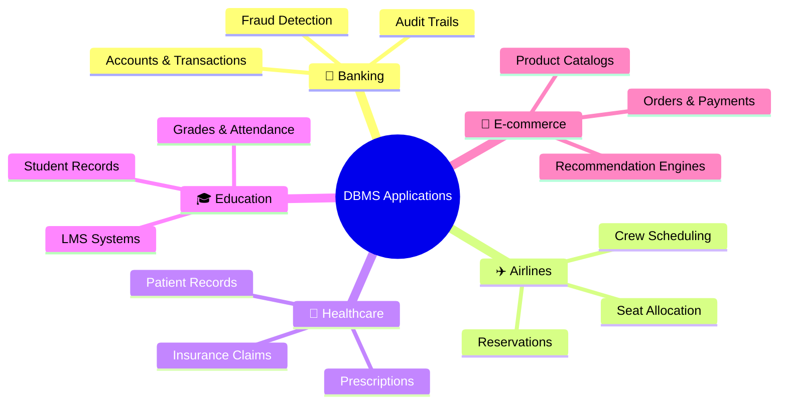
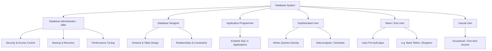

# 🗄️ Applications of DBMS; Database Users and Roles

> **Course:** Database Management Systems
> **Day:** Day 4 — Unit 1
> **Topics:** Applications of DBMS (Banking, Airlines, Healthcare, Education, E-commerce) · Introduction to Database Users and Roles

---

## 📌 Table of Contents

- [Applications of DBMS](#-applications-of-dbms)
  - [Overview Diagram](#overview-diagram)
  - [Banking](#-banking)
  - [Airlines](#️-airlines)
  - [Healthcare](#-healthcare)
  - [Education](#-education)
  - [E-commerce](#-e-commerce)
  - [Applications Summary Table](#applications-summary-table)
- [Introduction to Database Users and Roles](#-introduction-to-database-users-and-roles)
  - [Users Hierarchy Diagram](#users-hierarchy-diagram)
  - [Types of Database Users](#types-of-database-users)
  - [Key Roles & Responsibilities](#key-roles--responsibilities)
- [Key Takeaway](#-key-takeaway)

---

## 🏢 Applications of DBMS

### Overview Diagram

---

### 🏦 Banking

- Manages customer accounts, transactions, loans, and balances
- Ensures **ACID properties** so a transaction (like a fund transfer) either fully completes or doesn't happen at all
- Supports real-time fraud detection and audit trails

### ✈️ Airlines

- Manages flight schedules, seat reservations, and ticketing
- Handles **concurrent bookings** so two passengers can't be assigned the same seat
- Tracks crew schedules, baggage, and loyalty programs

### 🏥 Healthcare

- Stores patient records, prescriptions, diagnoses, and treatment history (EHR systems)
- Enforces strict **access control** since medical data is highly sensitive
- Supports hospital billing, insurance claims, and lab/test result tracking

### 🎓 Education

- Manages student records, grades, attendance, and course enrollment
- Connects relational data across students, faculty, and departments
- Powers learning management systems (LMS) and result-processing systems

### 🛒 E-commerce

- Manages product catalogs, inventory, orders, and customer data
- Handles massive **concurrent read/write** operations (browsing, checkout, payments)
- Powers recommendation engines through relational/behavioral data analysis

### Applications Summary Table

| Domain | Core Use | Critical DBMS Feature |
|---|---|---|
| 🏦 Banking | Transactions, balances | ACID compliance |
| ✈️ Airlines | Reservations, ticketing | Concurrency control |
| 🏥 Healthcare | Patient records | Access control & security |
| 🎓 Education | Student/grade records | Relational data modeling |
| 🛒 E-commerce | Orders, catalogs | High-volume concurrent access |

---

## 👥 Introduction to Database Users and Roles

A DBMS typically serves multiple types of users, each interacting with the system differently based on their needs and technical expertise.

### Users Hierarchy Diagram

### Types of Database Users

| User Type | Description |
|---|---|
| **Database Administrators (DBA)** | Responsible for overall management — security, backup, performance tuning, access control |
| **Database Designers** | Define the structure (schema) of the database — tables, relationships, constraints |
| **Application Programmers** | Write programs/applications that interact with the database (using SQL embedded in code) |
| **Sophisticated Users** | Interact directly with the database using query languages (e.g., analysts, data scientists) |
| **Naive/End Users** | Use pre-built applications/interfaces without knowledge of the underlying database (e.g., bank tellers, online shoppers) |
| **Casual Users** | Occasionally access the database for specific information needs (e.g., a manager checking a one-time report) |

### Key Roles & Responsibilities

> **DBA's role** is the most critical — they ensure the database stays secure, available, optimized, and recoverable in case of failure.

| Responsibility | Description |
|---|---|
| **Schema definition** | Deciding how data is structured (tables, columns, relationships) |
| **Access control management** | Granting/revoking permissions to different users |
| **Performance monitoring** | Optimizing queries and indexing for speed |
| **Backup & recovery planning** | Protecting against data loss |

---

## 💡 Key Takeaway

> DBMS applications span every major industry — banking, airlines, healthcare, education, and e-commerce — because each relies on **accurate, concurrent, and secure** data handling. Behind every database sits a layered structure of users, from DBAs managing the system to naive end-users who never see the underlying complexity.

---

*Notes prepared for DBMS Unit 1 — Day 4*

> 📝 **Note on diagrams:** The flowchart and mindmap above use **Mermaid syntax**, which renders automatically as visual diagrams in GitHub, VS Code, Obsidian, and most modern Markdown viewers.