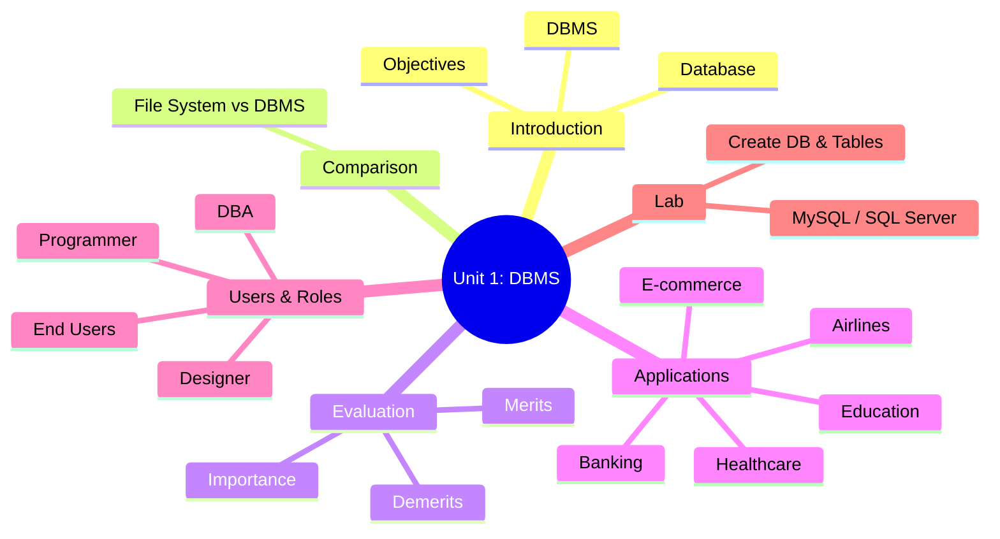
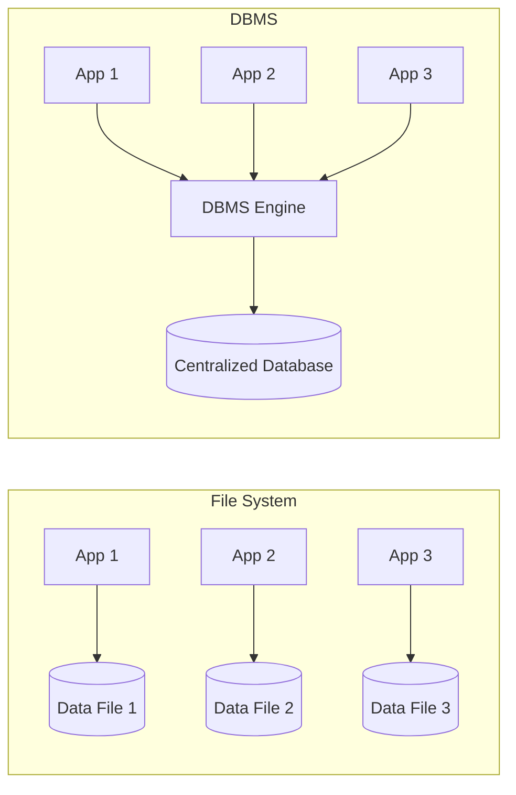
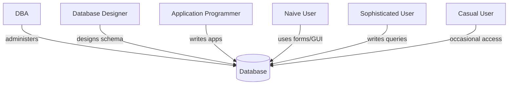

# 📘 Unit 1: Introduction to DBMS — Complete Exam Prep

> Covers: Database & DBMS basics, Objectives, File System vs DBMS, Importance, Merits/Demerits, Applications, Database Users & Roles, and Lab 01 (MySQL/SQL Server setup).

## 📑 Table of Contents
- [Unit Overview](#-unit-overview)
- [Important Long Questions (5 Marks)](#-important-long-questions-5-marks)
  - [Q1. Database, DBMS, Objectives](#q1-define-database-and-dbms-explain-the-objectives-of-dbms)
  - [Q2. File System vs DBMS](#q2-difference-between-file-system-and-dbms)
  - [Q3. Importance of DBMS](#q3-importance-of-dbms)
  - [Q4. Merits and Demerits of DBMS](#q4-merits-and-demerits-of-dbms)
  - [Q5. Applications of DBMS](#q5-applications-of-dbms)
  - [Q6. Database Users and Roles](#q6-database-users-and-roles)
- [Short Questions (2 Marks)](#-short-questions-2-marks)
- [MCQs](#-mcqs)
- [Lab 01 — Quick Reference](#-lab-01--quick-reference-mysql--ms-sql-server)
- [🎯 Priority Revision Guide](#-priority-revision-guide)

---

## 📅 Unit Overview

| Day | Session | Topic |
|---|---|---|
| Monday | Theory | Introduction to Database & DBMS; Objectives of DBMS; File System vs DBMS |
| Tuesday | Theory | Importance of DBMS; Merits and Demerits of DBMS |
| Wednesday | Tutorial | Real-world DBMS vs flat file discussion; advantages/limitations exercise |
| Thursday | Theory | Applications of DBMS (Banking, Airlines, Healthcare, Education, E-commerce); Database Users & Roles |
| Friday | Practical | Lab 01 — Installing MySQL/MS SQL Server; first database & tables |



---

## 📘 Important Long Questions (5 Marks)

### Q1. Define Database and DBMS. Explain the objectives of DBMS.

**Database**: An organized, structured collection of related data stored electronically, allowing efficient storage, retrieval, and management.

**DBMS**: Software that enables users to define, create, maintain, and control access to a database, acting as an interface between users/applications and the physical data. *Examples: MySQL, Oracle, MS SQL Server, PostgreSQL.*

**Objectives of DBMS:**

| Objective | Explanation |
|---|---|
| Data Redundancy Control | Minimize duplicate storage of the same data |
| Data Consistency | Ensure all copies/views of data remain accurate and uniform |
| Data Integrity | Maintain accuracy and validity of data via constraints |
| Data Security | Restrict unauthorized access through authentication/authorization |
| Data Independence | Separate physical storage details from logical structure |
| Concurrent Access | Allow multiple users to access/modify data safely at once |
| Efficient Data Access | Provide fast retrieval via indexing and query optimization |
| Backup & Recovery | Protect against data loss due to failures |

> 💡 **Key takeaway:** The core objective of DBMS is to manage data efficiently while solving the redundancy, inconsistency, and security problems inherent in traditional file systems.

---

### Q2. Difference between File System and DBMS

| Basis | File System | DBMS |
|---|---|---|
| Data Redundancy | High — same data often duplicated across files | Low — centralized storage minimizes duplication |
| Data Consistency | Difficult to maintain across multiple files | Maintained automatically through centralized control |
| Data Sharing | Limited, file-specific access | Multiple users can share data simultaneously |
| Data Security | Minimal, file-level permissions only | Strong — user-level authentication & authorization |
| Data Integrity | Enforced manually in application code | Enforced via constraints (PK, FK, CHECK, etc.) |
| Backup & Recovery | Manual, often unreliable | Built-in automated backup & recovery tools |
| Query Capability | No standard query language | Supports SQL for flexible queries |
| Concurrent Access | Prone to conflicts, no proper control | Managed through locking/transaction control |
| Data Independence | Tightly coupled — program depends on file structure | Logical and physical data independence |
| Cost & Complexity | Low cost, simple to set up | Higher cost, needs skilled administration |



> 💡 **Key takeaway:** File systems store data in isolated files per application; DBMS centralizes data so all applications go through one controlled engine.

---

### Q3. Importance of DBMS

- **Centralized data management** — single source of truth for the organization.
- **Reduced redundancy** — saves storage and avoids update anomalies.
- **Improved data integrity and accuracy** through constraints and validation rules.
- **Better data security** — role-based access control and authentication.
- **Efficient data retrieval** — SQL and indexing enable fast, flexible queries.
- **Support for concurrent multi-user access** without data corruption.
- **Reliable backup and disaster recovery** mechanisms.
- **Scalability** — handles growing volumes of data as organizations grow.
- **Supports decision-making** by enabling complex queries, reports, and analytics.

> 💡 **Key takeaway:** DBMS is important because it transforms scattered, unmanaged data into a secure, consistent, and query-able organizational asset.

---

### Q4. Merits and Demerits of DBMS

| Merits ✅ | Demerits ❌ |
|---|---|
| Reduces data redundancy | High cost of software, hardware, and skilled staff |
| Ensures data consistency | Increased complexity of system design |
| Enforces data integrity via constraints | Larger storage/processing overhead |
| Improves data security & access control | Risk of single point of failure if not managed well |
| Enables data sharing among multiple users | Requires regular maintenance and tuning |
| Supports concurrent access with transaction control | Migration from legacy systems can be difficult |
| Provides backup & recovery facilities | Overkill for very small/simple applications |
| Offers data independence (logical/physical) | Performance overhead compared to simple flat files for trivial tasks |

> 💡 **Key takeaway:** DBMS trades higher setup cost and complexity for long-term gains in consistency, security, and scalability — a worthwhile trade-off for any non-trivial application.

---

### Q5. Applications of DBMS

| Sector | Use Case |
|---|---|
| **Banking** | Customer accounts, transactions, loans, ATM networks, fraud detection |
| **Airlines** | Reservations, ticketing, scheduling, crew management, real-time seat availability |
| **Healthcare** | Patient records (EHR), billing, appointment scheduling, pharmacy & lab management |
| **Education** | Student records, results, admissions, library systems, course registration |
| **E-commerce** | Product catalogs, inventory, orders, payments, customer accounts, recommendations |

> 💡 **Key takeaway:** Any sector dealing with large, sensitive, frequently-updated, and multi-user data relies on DBMS rather than flat files.

---

### Q6. Database Users and Roles

| User Type | Role |
|---|---|
| **Database Administrator (DBA)** | Manages the overall database — security, performance, backup, user access |
| **Database Designer** | Designs the logical/physical schema, defines tables, relationships, constraints |
| **Application Programmers** | Write application code that interacts with the database (using SQL/APIs) |
| **End Users — Naive** | Use predefined interfaces/forms (e.g., bank tellers, cashiers) with no SQL knowledge |
| **End Users — Sophisticated** | Write and execute their own queries (e.g., analysts, engineers) |
| **End Users — Casual** | Access the database occasionally for specific information needs |
| **System Analyst** | Determines requirements of end users and designs system specifications |



> 💡 **Key takeaway:** Roles range from technical (DBA, Designer, Programmer) to non-technical (Naive/Casual end users) — each interacts with the database at a different level.

---

## ✏️ Short Questions (2 Marks)

1. **Define Database.** An organized collection of related data stored electronically for easy access and management.
2. **Define DBMS.** Software that allows creation, management, and controlled access to databases.
3. **Name any two objectives of DBMS.** Data redundancy control and data security.
4. **What is data redundancy?** Unnecessary duplication of the same data at multiple places.
5. **What is data independence?** The ability to change the schema at one level without affecting another level (logical/physical).
6. **List two merits of DBMS.** Reduced redundancy and improved data security.
7. **List two demerits of DBMS.** High cost and increased system complexity.
8. **Name any two applications of DBMS.** Banking systems and airline reservation systems.
9. **Who is a DBA?** The person responsible for administering and managing the entire database system.
10. **What is a naive user?** A user who interacts with the database only through predefined applications/forms, without SQL knowledge.
11. **What is a flat file system?** A system that stores data in simple text/binary files without relationships between them.
12. **Give one example each of a DBMS software.** MySQL, Oracle, MS SQL Server, PostgreSQL.

---

## ❓ MCQs

1. **DBMS stands for:**
   a) Data Basic Management System b) **Database Management System** c) Data Base Manipulation Software d) Digital Base Management System

2. **Which of the following is NOT an objective of DBMS?**
   a) Data redundancy control b) Data security c) **Increasing data duplication** d) Data integrity

3. **A collection of related data organized for easy access is called a:**
   a) File b) **Database** c) Record d) Field

4. **Which problem is common in traditional file systems but solved by DBMS?**
   a) Data independence b) **Data redundancy** c) Query optimization d) Indexing

5. **Which of these is an example of a DBMS?**
   a) MS Word b) MS Excel c) **MySQL** d) Notepad

6. **Data independence means:**
   a) Data has no structure b) **Changes at one level don't affect another level** c) Data cannot be shared d) Data is duplicated

7. **Which of the following is a demerit of DBMS?**
   a) Data consistency b) **High cost of hardware/software** c) Data security d) Reduced redundancy

8. **In which sector is DBMS used for reservation and ticketing?**
   a) Healthcare b) Education c) **Airlines** d) Banking

9. **Who is responsible for the overall management of a database?**
   a) End User b) **Database Administrator (DBA)** c) Application Programmer d) Casual User

10. **A user who interacts with the database using forms without knowing SQL is called a:**
    a) Sophisticated user b) **Naive user** c) System analyst d) DBA

11. **Which of the following ensures accuracy and validity of data?**
    a) Data redundancy b) **Data integrity** c) Data duplication d) File indexing

12. **Which is NOT a benefit of using DBMS over a file system?**
    a) Better security b) Reduced redundancy c) **Higher redundancy** d) Data sharing

13. **Which user type writes their own complex SQL queries?**
    a) Naive user b) Casual user c) **Sophisticated user** d) DBA only

14. **MySQL and MS SQL Server are examples of:**
    a) Operating Systems b) **DBMS software** c) Programming languages d) Web browsers

15. **Which of the following is an application of DBMS in healthcare?**
    a) Seat booking b) **Patient record management** c) Stock trading d) Course registration

**Answer Key:** 1-b, 2-c, 3-b, 4-b, 5-c, 6-b, 7-b, 8-c, 9-b, 10-b, 11-b, 12-c, 13-c, 14-b, 15-b

---

## 🧪 Lab 01 — Quick Reference (MySQL / MS SQL Server)

**Installation basics:**
- **MySQL**: Install MySQL Server + MySQL Workbench (GUI) → set root password during setup → connect via Workbench or CLI (`mysql -u root -p`).
- **MS SQL Server**: Install SQL Server (Developer/Express edition) + SQL Server Management Studio (SSMS) → connect using Windows/SQL Authentication.

**First commands:**

```sql
-- Create a database
CREATE DATABASE LibraryDB;

-- Select the database to use
USE LibraryDB;

-- Create a simple table
CREATE TABLE Student (
    StudentId INT PRIMARY KEY,
    Name VARCHAR(50) NOT NULL,
    Age INT
);

-- Insert data
INSERT INTO Student (StudentId, Name, Age) VALUES (1, 'Ramesh Sharma', 20);

-- View data
SELECT * FROM Student;
```

> 💡 **Key takeaway:** Lab 01 is about orientation — getting comfortable with the DBMS environment, not complex queries. Focus on `CREATE DATABASE`, `CREATE TABLE`, `INSERT`, and `SELECT`.

---

## 🎯 Priority Revision Guide

| Priority | Topics |
|---|---|
| 🔴 Must Know | File System vs DBMS, Merits & Demerits, Database Users & Roles |
| 🟠 High | Objectives of DBMS, Applications of DBMS |
| 🟡 Medium | Importance of DBMS (overlaps with objectives/merits) |
| 🟢 Review | MCQs and short questions for quick revision before exam |

> 💡 **Exam strategy:** "File System vs DBMS" and "Merits & Demerits" are the most frequently asked long questions in this unit — know them cold. MCQs here are a good gauge of overall unit readiness.

---
*Course: Database Management System (CACS255) | BCA Semester IV | TU Notes Series*