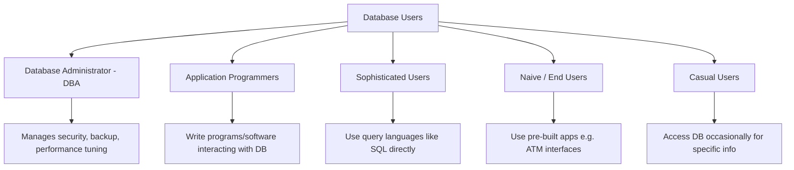

# 📝 Unit 1 — Exam Question Bank (DBMS)

> **BCA 4th Semester** — Important 5-Mark & Short Questions based on Week 1 topics: Introduction to DBMS, Objectives, File System vs DBMS, Merits/Demerits, Applications, and Database Users.

---

## 📑 Table of Contents

- [🎯 5-Mark Questions](#-5-mark-questions)
  - [Q1. Database & DBMS with Objectives](#q1-what-is-a-database-and-dbms-explain-with-its-objectives)
  - [Q2. File System vs DBMS](#q2-differentiate-between-file-system-and-dbms)
  - [Q3. Merits and Demerits of DBMS](#q3-explain-the-merits-and-demerits-of-dbms)
  - [Q4. Importance/Need of DBMS](#q4-explain-the-importanceneed-of-dbms)
  - [Q5. Applications of DBMS](#q5-explain-the-applications-of-dbms-with-examples)
  - [Q6. Database Users and Roles](#q6-what-are-database-users-and-their-roles)
- [✍️ Short Questions (2 Marks each)](#️-short-questions-2-marks-each)
- [🌟 Priority Guide](#-priority-guide-if-short-on-time)

---

## 🎯 5-Mark Questions

### Q1. What is a Database and DBMS? Explain with its objectives.

**Database**: An organized collection of related data stored in a structured format that can be easily accessed, managed, and updated.

**DBMS (Database Management System)**: Software that enables users to define, create, maintain, and control access to databases. It acts as an interface between the user and the database.

**Objectives of DBMS:**

| Objective | Explanation |
|---|---|
| Data Independence | Changes in storage structure don't affect applications |
| Data Redundancy Control | Minimizes duplicate data across files |
| Data Consistency | Ensures data remains accurate after updates |
| Data Security | Restricts unauthorized access via authentication |
| Data Integrity | Maintains accuracy and validity using constraints |
| Concurrent Access | Allows multiple users to access data simultaneously |
| Backup & Recovery | Restores data in case of failure/crash |

---

### Q2. Differentiate between File System and DBMS.

> ⭐ **High-frequency question — asked almost every year**

| Basis | File System | DBMS |
|---|---|---|
| Data Redundancy | High (same data repeated in multiple files) | Low (centralized data) |
| Data Integrity | Difficult to maintain | Easily enforced via constraints |
| Data Security | Minimal security | Strong security via authentication/authorization |
| Data Sharing | Difficult, one program per file | Easy, multiple users can share |
| Backup/Recovery | Manual, unreliable | Automatic and reliable |
| Query Processing | No query language, needs custom code | Uses SQL for easy querying |
| Concurrent Access | Not well supported | Supported with locking mechanisms |
| Cost | Cheap, simple | Costly, needs skilled DBA |

---

### Q3. Explain the Merits and Demerits of DBMS.

**✅ Merits (Advantages):**
- Reduces data redundancy and inconsistency
- Improves data security and integrity
- Supports concurrent access and multi-user environment
- Provides backup and recovery mechanism
- Enables data independence
- Reduces application development time

**❌ Demerits (Disadvantages):**
- High cost of hardware, software, and skilled staff
- Increased complexity of system
- Requires trained DBA (Database Administrator)
- Performance overhead compared to simple file systems
- Risk of centralized failure — if DBMS crashes, whole system is affected

---

### Q4. Explain the Importance/Need of DBMS.

- Eliminates redundant and inconsistent data
- Provides efficient data access using SQL
- Ensures data security through user-level access control
- Maintains data integrity via constraints (primary key, foreign key, etc.)
- Supports multiple user access without conflict
- Provides backup and disaster recovery
- Reduces application development and maintenance time

---

### Q5. Explain the Applications of DBMS with examples.

> ⭐ **High-frequency question**

| Sector | Application |
|---|---|
| **Banking** | Customer accounts, transactions, loans, ATM operations |
| **Airlines** | Reservation systems, flight schedules, ticket booking |
| **Healthcare** | Patient records, billing, appointment scheduling |
| **Education** | Student records, results, admission, fee management |
| **E-commerce** | Product catalog, orders, inventory, customer data, payment tracking |

> **Key takeaway:** DBMS is used wherever large volumes of structured data need to be stored, retrieved, and updated reliably and securely.

---

### Q6. What are Database Users and their Roles?

| User Type | Role |
|---|---|
| **Database Administrator (DBA)** | Manages entire database — security, backup, performance tuning |
| **Application Programmers** | Write programs/software that interact with the database |
| **Sophisticated Users** | Interact using query languages (SQL) without writing full programs |
| **Naive/End Users** | Use pre-built applications via simple interfaces (e.g., ATM users) |
| **Casual Users** | Occasionally access database for specific information needs |

---

## ✍️ Short Questions (2 Marks each)

**S1. Define Data Redundancy.**
Data redundancy means the same piece of data is stored in multiple places within a system, leading to wasted storage and inconsistency risks. DBMS minimizes this through centralized data storage.

**S2. What is Data Independence?**
Data independence is the capacity to change the schema (structure) of the database at one level without affecting the schema at the next higher level, so applications remain unaffected by storage changes.

**S3. What is a DBA (Database Administrator)?**
A DBA is the person responsible for the overall management of the database system, including security, access control, backup/recovery, and performance monitoring.

**S4. Name any four popular DBMS software.**
MySQL, Oracle, Microsoft SQL Server, PostgreSQL (also: MongoDB, SQLite, IBM DB2).

**S5. What is Data Integrity?**
Data integrity refers to the accuracy, consistency, and reliability of data stored in a database, maintained through constraints like primary key, foreign key, unique, and check constraints.

---

## 🌟 Priority Guide (If Short on Time)

> Focus on these three if revision time is limited:

1. **Q2** — Difference between File System and DBMS
2. **Q1** — Objectives of DBMS
3. **Q5** — Applications of DBMS

---

📘 *Course: BCA 4th Semester — Database Management Systems (Unit 1)*