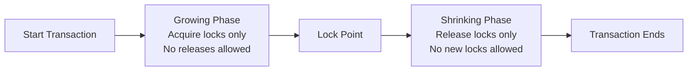
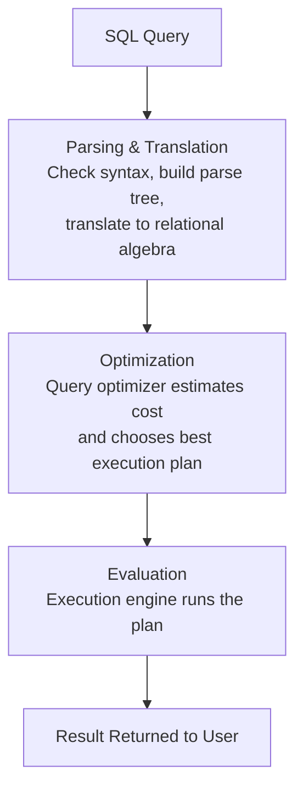
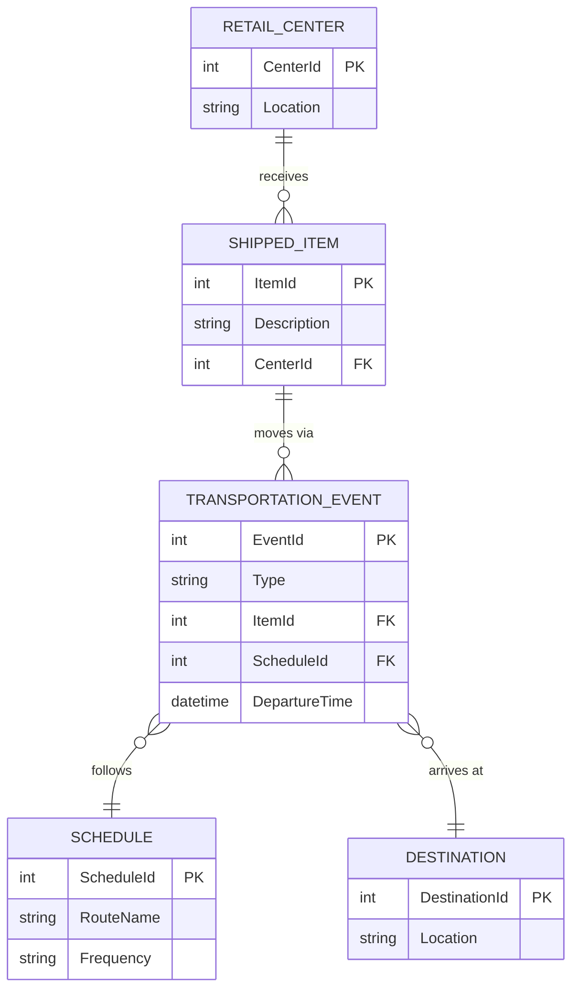

# 📝 DBMS Model Question Paper Solution — 2023 (TU BCA, Sem IV)

> Solved paper for **CACS255 – Database Management System**, Tribhuvan University, Faculty of Humanities & Social Sciences. Full Marks: 60 | Batch: 2020.

## 📑 Table of Contents
- [Exam Overview](#-exam-overview)
- [Group B (Attempt any SIX) — 5 Marks Each](#-group-b-attempt-any-six--5-marks-each)
  - [Q1. Database & DBMS — Benefits](#q1-define-database-and-dbms-explain-the-benefits-of-dbms-in-detail)
  - [Q2. SQL Constraints](#q2-sql-constraints)
  - [Q3. Relational Algebra](#q3-relational-algebra)
  - [Q4. Candidate Key vs Primary Key, Foreign Key](#q4-candidate-key-vs-primary-key-and-foreign-key)
  - [Q5. Stored Procedure](#q5-stored-procedure)
  - [Q6. Concurrency Control & 2PL](#q6-concurrency-control--two-phase-locking-2pl)
  - [Q7. Database Security & Query Processing](#q7-database-security--query-processing)
- [Group C (Attempt any TWO) — 10 Marks Each](#-group-c-attempt-any-two--10-marks-each)
  - [Q9. Functional Dependencies, 2NF & 3NF](#q9-functional-dependencies-2nf--3nf)
  - [Q10. Join Operations & ER Diagram](#q10-join-operations--er-diagram-shipment-company)
  - [Q11. SQL Queries — Library Schema](#q11-sql-queries--library-schema)
- [🎯 Priority Revision Guide](#-priority-revision-guide)

---

## 📄 Exam Overview

| Detail | Value |
|---|---|
| Course | Database Management System |
| Code | CACS255 |
| Semester | IV |
| Full Marks | 60 |
| Pass Marks | 24 |
| Time | 3 hours |
| Structure | Group B: 6×5=30, Group C: 2×10=20 (+ Group A, not shown here) |

---

## 📘 Group B (Attempt any SIX) — 5 Marks Each

### Q1. Define database and DBMS. Explain the benefits of DBMS in detail.

**Database**: An organized, structured collection of related data stored electronically so it can be efficiently accessed, managed, and updated.

**DBMS (Database Management System)**: Software that lets users define, create, maintain, and control access to a database. It sits between the user/application and the physical data. *Examples: MySQL, Oracle, SQL Server, PostgreSQL.*

**Benefits of DBMS:**

| Benefit | Explanation |
|---|---|
| Redundancy Control | Centralized storage + normalization reduces duplicate data |
| Data Consistency | Updating data in one place reflects everywhere it's used |
| Data Sharing | Multiple users/applications can access data concurrently |
| Data Integrity | Constraints (PK, FK, CHECK) keep data accurate and valid |
| Data Security | Authentication, authorization, and encryption restrict access |
| Backup & Recovery | Built-in mechanisms to restore data after failure/crash |
| Concurrent Access Control | Transaction & locking mechanisms prevent conflicts |
| Data Independence | Applications are insulated from changes in physical storage |
| Faster Development | SQL and built-in tools reduce application development effort |
| Standardization | Enforces naming, format, and documentation standards |

> 💡 **Key takeaway:** DBMS solves the core problems of traditional file systems — redundancy, inconsistency, and poor security — by centralizing control over data.

---

### Q2. SQL Constraints

SQL constraints enforce rules on data in a table to maintain accuracy and reliability.

| Constraint | Purpose | Example |
|---|---|---|
| `NOT NULL` | Column cannot store NULL value | `Name VARCHAR(50) NOT NULL` |
| `UNIQUE` | All values in column must be different | `Email VARCHAR(100) UNIQUE` |
| `PRIMARY KEY` | Uniquely identifies each row (NOT NULL + UNIQUE) | `BookId INT PRIMARY KEY` |
| `FOREIGN KEY` | Links a column to a PRIMARY KEY in another table | `FOREIGN KEY(CardNo) REFERENCES Borrower(CardNo)` |
| `CHECK` | Ensures values satisfy a specific condition | `CHECK (Price > 0)` |
| `DEFAULT` | Sets a default value when none is supplied | `Status VARCHAR(10) DEFAULT 'Active'` |
| `AUTO_INCREMENT` | Automatically generates a unique number for new rows | `Id INT AUTO_INCREMENT` |

> 💡 **Key takeaway:** Constraints are the DBMS's way of enforcing integrity rules automatically, without relying on application code.

---

### Q3. Relational Algebra

**Relational Algebra (RA)** is a procedural query language: it takes one or more relations as input and produces a new relation as output. It forms the theoretical foundation for SQL.

**Fundamental (basic) operations:**

| Operation | Symbol | Description |
|---|---|---|
| Select | σ (sigma) | Filters rows matching a condition |
| Project | π (pi) | Selects specific columns |
| Union | ∪ | Combines rows of two union-compatible relations |
| Set Difference | − | Rows in one relation but not another |
| Cartesian Product | × | Combines every row of one relation with every row of another |
| Rename | ρ (rho) | Renames a relation or its attributes |

**Derived operations (built from basic ones):**

| Operation | Symbol | Description |
|---|---|---|
| Intersection | ∩ | Rows common to both relations |
| Join | ⋈ | Combines related rows from two relations based on a condition |
| Division | ÷ | Finds tuples related to all tuples in another relation |

> 💡 **Key takeaway:** SQL's `SELECT`, `WHERE`, `JOIN`, and `UNION` clauses are direct implementations of relational algebra operations.

---

### Q4. Candidate Key vs Primary Key, and Foreign Key

**[1 mark] Difference:**

| Candidate Key | Primary Key |
|---|---|
| A minimal set of attribute(s) that can uniquely identify a tuple | The candidate key chosen by the designer to be the main identifier |
| A table can have multiple candidate keys | A table has only one primary key |
| Can technically allow NULL (in theory) | Cannot be NULL |
| Not all candidate keys are used for referencing | Used for referencing in foreign keys |

**[4 marks] Foreign Key:**

A **foreign key** is an attribute (or set of attributes) in one table that references the **primary key** of another table. It establishes and enforces a link (referential integrity) between two tables.

- Ensures that values inserted in the referencing table must exist in the referenced table.
- Prevents actions that would destroy links between tables (e.g., deleting a referenced row).
- Can accept NULL values (unless explicitly restricted), unlike primary keys.
- Enables enforcement of relationships like one-to-many and many-to-many (via junction tables).

```sql
CREATE TABLE BookIssue (
    BookId INT,
    CardNo INT,
    IssuedDate DATE,
    DueDate DATE,
    FOREIGN KEY (BookId) REFERENCES Book(BookId),
    FOREIGN KEY (CardNo) REFERENCES Borrower(CardNo)
);
```

> 💡 **Key takeaway:** Primary key = "who am I", Foreign key = "who do I belong to". Together they enforce referential integrity across tables.

---

### Q5. Stored Procedure

**[2 marks] What is it:** A stored procedure is a precompiled collection of one or more SQL statements, stored under a name in the database, that can be executed (called) as a single unit, optionally with input/output parameters.

**[3 marks] How it's used + Example:**

- Encapsulates business logic inside the database itself.
- Reusable — called repeatedly without rewriting SQL.
- Improves performance (precompiled execution plan) and reduces network traffic (one call instead of many statements).
- Improves security — users can be given `EXECUTE` permission without direct table access.

```sql
DELIMITER //
CREATE PROCEDURE GetBooksByAuthor(IN authorName VARCHAR(100))
BEGIN
    SELECT b.Title
    FROM Book b
    JOIN Book_Authors ba ON b.BookId = ba.BookId
    WHERE ba.Author_name = authorName;
END //
DELIMITER ;

-- Calling it:
CALL GetBooksByAuthor('Laxmi Prashad Devkota');
```

> 💡 **Key takeaway:** Stored procedures move logic closer to the data — faster, reusable, and more secure than sending raw SQL from the application every time.

---

### Q6. Concurrency Control & Two-Phase Locking (2PL)

**[1 mark] Purposes of concurrency control:**
- Prevent the **lost update** problem
- Avoid **dirty reads** (reading uncommitted data)
- Ensure **isolation** between simultaneous transactions
- Guarantee **serializability** (concurrent execution = some serial execution)
- Maintain overall database **consistency**

**[4 marks] Two-Phase Locking (2PL) Protocol:**

2PL ensures serializability by dividing a transaction's life into two distinct phases:



- **Growing Phase**: transaction may acquire locks but cannot release any.
- **Shrinking Phase**: transaction may release locks but cannot acquire any new ones.
- Once the first lock is released, no further locks can be obtained (the "lock point").

**Variants:**
| Variant | Rule |
|---|---|
| Basic 2PL | Locks released anytime after lock point |
| Strict 2PL | All exclusive locks held until COMMIT/ROLLBACK |
| Rigorous 2PL | All locks (shared + exclusive) held until COMMIT/ROLLBACK |

> 💡 **Key takeaway:** 2PL guarantees conflict-serializable schedules, but strict variants are preferred in practice to also avoid cascading rollbacks.

---

### Q7. Database Security & Query Processing

**[2 marks] Database Security:** Protecting the database from unauthorized access, misuse, or malicious attacks, ensuring **Confidentiality, Integrity, and Availability (CIA)**. Techniques include authentication, authorization (DAC/MAC), encryption, views, auditing, backups, and SQL-injection prevention.

**[3 marks] Steps of Query Processing:**



1. **Parsing & Translation** — checks syntax/semantics, converts SQL into an internal relational algebra expression.
2. **Optimization** — the query optimizer evaluates multiple execution plans and selects the lowest-cost one using statistics (indexes, table size, etc.).
3. **Evaluation** — the execution engine runs the chosen plan against the actual data and returns results.

> 💡 **Key takeaway:** The optimizer is the "brain" of query processing — the same SQL can be executed many different ways, and the DBMS picks the cheapest.

---

## 📗 Group C (Attempt any TWO) — 10 Marks Each

### Q9. Functional Dependencies, 2NF & 3NF

**[4 marks] Functional Dependencies:**

A functional dependency X → Y means the value of X uniquely determines the value of Y.

| Type | Definition |
|---|---|
| **Full Functional Dependency** | Y depends on the *entire* composite key X, not on any proper subset of X |
| **Partial Functional Dependency** | Y depends on only *part* of a composite primary key |

*Example:* In `{StudentId, CourseId} → Marks`, Marks depends on the full combination — full dependency. But if `{StudentId, CourseId} → StudentName`, and StudentName only depends on StudentId, that's a **partial dependency**.

**[6 marks] 2NF and 3NF:**

**2NF (Second Normal Form):** A table is in 2NF if it is already in 1NF **and** has no partial dependency — every non-prime (non-key) attribute is fully functionally dependent on the whole primary key.

*Example:* `Enrollment(StudentId, CourseId, StudentName, Marks)` with PK `{StudentId, CourseId}` — `StudentName` depends only on `StudentId` (partial dependency) → violates 2NF. Fix by splitting:
- `Student(StudentId, StudentName)`
- `Enrollment(StudentId, CourseId, Marks)`

**3NF (Third Normal Form):** A table is in 3NF if it is already in 2NF **and** has no transitive dependency — non-key attributes depend only on the primary key, not on other non-key attributes.

*Example:* `Employee(EmpId, DeptId, DeptName)` — `DeptName` depends on `DeptId`, which depends on `EmpId` (transitive) → violates 3NF. Fix by splitting:
- `Employee(EmpId, DeptId)`
- `Department(DeptId, DeptName)`

> 💡 **Key takeaway:** 2NF removes *partial* dependency (only relevant with composite keys); 3NF removes *transitive* dependency (non-key → non-key).

---

### Q10. Join Operations & ER Diagram (Shipment Company)

**[5 marks] Join Operations:**

| Join Type | Description | Example |
|---|---|---|
| **Inner Join** | Returns only matching rows from both tables | `SELECT * FROM A JOIN B ON A.id=B.id` |
| **Left Outer Join** | All rows from left table + matches from right (NULL if none) | `SELECT * FROM A LEFT JOIN B ON A.id=B.id` |
| **Right Outer Join** | All rows from right table + matches from left | `SELECT * FROM A RIGHT JOIN B ON A.id=B.id` |
| **Full Outer Join** | All rows from both tables, matched where possible | `SELECT * FROM A FULL JOIN B ON A.id=B.id` |
| **Self Join** | A table joined with itself | `SELECT a.name,b.name FROM Emp a, Emp b WHERE a.mgr_id=b.id` |
| **Cross Join (Cartesian)** | Every row of A with every row of B | `SELECT * FROM A CROSS JOIN B` |
| **Natural Join** | Auto-joins on columns with the same name | `SELECT * FROM A NATURAL JOIN B` |

**[5 marks] ER Diagram — Shipment Company:**

*Scenario:* Items are received at a single retail center, then move through one or more scheduled transportation events (flights, truck deliveries) to reach their destination.



> 💡 **Key takeaway:** One item can pass through *multiple* transportation events (one-to-many, ordered) before reaching its final destination — this is the core relationship to capture correctly.

---

### Q11. SQL Queries — Library Schema

**Schema:**
```
Book(BookId, Title, Publisher, PublishedDate, Price)
Book_Authors(BookId, Author_name)
Borrower(CardNo, Name, Address, Contact)
BookIssue(BookId, CardNo, IssuedDate, DueDate)
```

**a) Books taken by Ramesh Sharma [2 marks]**
```sql
SELECT b.Title
FROM Book b
JOIN BookIssue bi ON b.BookId = bi.BookId
JOIN Borrower br ON bi.CardNo = br.CardNo
WHERE br.Name = 'Ramesh Sharma';
```

**b) Issued book & borrower name — issued before 15 May 2023, due after 15 June 2023 [2 marks]**
```sql
SELECT b.Title, br.Name
FROM Book b
JOIN BookIssue bi ON b.BookId = bi.BookId
JOIN Borrower br ON bi.CardNo = br.CardNo
WHERE bi.IssuedDate < '2023-05-15'
  AND bi.DueDate > '2023-06-15';
```

**c) Borrower who took a book written by Laxmi Prashad Devkota [2 marks]**
```sql
SELECT DISTINCT br.Name
FROM Borrower br
JOIN BookIssue bi ON br.CardNo = bi.CardNo
JOIN Book_Authors ba ON bi.BookId = ba.BookId
WHERE ba.Author_name = 'Laxmi Prashad Devkota';
```

**d) Number of books issued on 25th April 2023 [2 marks]**
```sql
SELECT COUNT(*) AS NumberOfBooksIssued
FROM BookIssue
WHERE IssuedDate = '2023-04-25';
```

**e) Borrower who took a book priced above the average price [2 marks]**
```sql
SELECT DISTINCT br.Name
FROM Borrower br
JOIN BookIssue bi ON br.CardNo = bi.CardNo
JOIN Book b ON bi.BookId = b.BookId
WHERE b.Price > (SELECT AVG(Price) FROM Book);
```

> 💡 **Key takeaway:** These queries revolve around three join patterns — direct join (a, d), triple join across issue+borrower+book (b), and subquery-based comparison (e).

---

## 🎯 Priority Revision Guide

| Priority | Topics |
|---|---|
| 🔴 Must Know | DBMS benefits, SQL constraints, Primary/Foreign key, SQL queries (joins & subqueries) |
| 🟠 High | Relational algebra operations, 2NF/3NF, Join types |
| 🟡 Medium | Stored procedures, 2PL protocol, ER diagram modeling |
| 🟢 Review | Database security, Query processing steps |

> 💡 **Exam strategy:** Group B — pick your strongest 6 of 7 (SQL constraints & keys are usually fastest to score full marks on). Group C — Q11 (SQL queries) is the safest 10-mark pick if you're confident with joins/subqueries; pair it with Q9 (normalization) or Q10 (joins + ER) depending on strength.

---
*Course: Database Management System (CACS255) | BCA Semester IV | TU Notes Series*