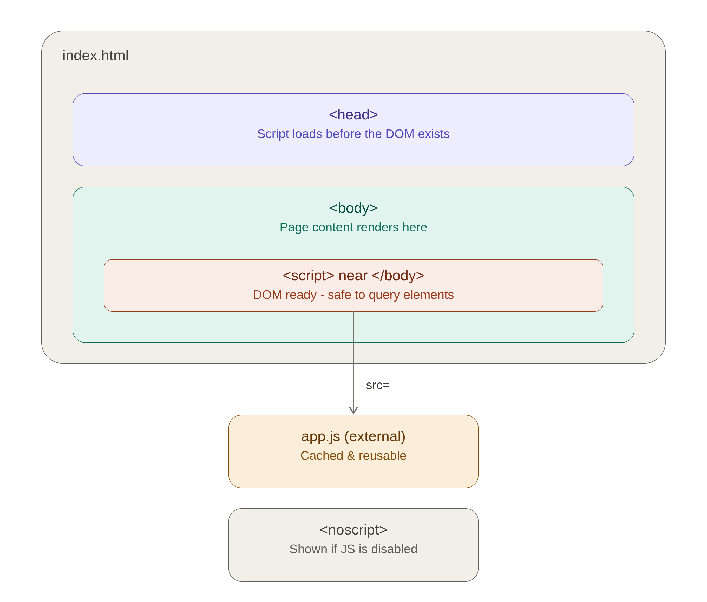
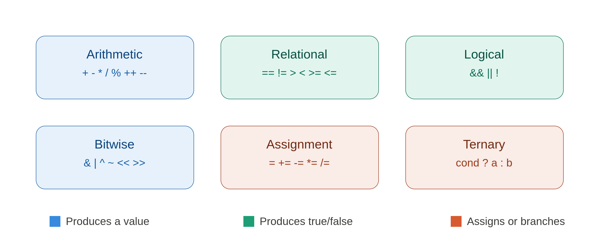

# 📘 CACS254 — Scripting Language | Unit 1, Day 3

## Embedding JavaScript in HTML + JavaScript Operators

---

## 🎯 Topics Covered

- Embedding JavaScript in HTML using the `<script>` tag (Head, Body, External)
- The `<noscript>` tag
- JavaScript Operators: Arithmetic, Relational, Logical, Bitwise, Assignment, Ternary

---

## 1️⃣ Embedding JavaScript in HTML

JavaScript can be inserted into a web page in three ways. Where you place it changes *when* it runs relative to the page content.



### Script in `<head>`

```html
<!DOCTYPE html>
<html>
<head>
  <script>
    function greet() {
      console.log("Hello from the head!");
    }
  </script>
</head>
<body>
  <h1>My Page</h1>
</body>
</html>
```

Runs **before** the page body is parsed. Good for defining functions to be called later, but DOM elements below it don't exist yet if you try to access them immediately.

### Script in `<body>` (near the end)

```html
<body>
  <h1>My Page</h1>
  <p id="msg"></p>

  <script>
    document.getElementById("msg").innerText = "DOM is ready!";
  </script>
</body>
```

The most common placement. By the time the browser reaches this script, the entire DOM above it has already been built, so element access is safe.

### External Script File

```html
<head>
  <script src="app.js"></script>
</head>
```

```javascript
// app.js
console.log("Loaded from an external file");
```

The professional standard: the file can be **cached** by the browser, **reused** across multiple pages, and keeps JavaScript logic separate from HTML markup.

### `<noscript>` Tag

```html
<noscript>
  <p>Please enable JavaScript to use this website.</p>
</noscript>
```

Displays fallback content only when JavaScript is disabled or unsupported in the user's browser.

### 📊 Comparison Table

| Placement | Runs When | Best For | DOM Access |
|---|---|---|---|
| `<head>` | Before body loads | Function definitions, early setup | ❌ Risky (DOM not ready) |
| `<body>` (end) | After DOM is built | Most general-purpose scripts | ✅ Safe |
| External file | Depends on placement of `<script src>` | Reusable, large codebases | Depends on placement |
| `<noscript>` | When JS is disabled | Fallback messages | N/A (no JS runs) |

> 🧠 **Mnemonic:** "**H**ead **B**efore, **B**ody **A**fter" — Head scripts run **B**efore the page exists, Body scripts run **A**fter the DOM is ready.

---

## 2️⃣ JavaScript Operators



| Category | Operators | Produces |
|---|---|---|
| Arithmetic | `+ - * / % ++ --` | A value |
| Relational | `== != === !== > < >= <=` | `true` / `false` |
| Logical | `&& \|\| !` | `true` / `false` |
| Bitwise | `& \| ^ ~ << >> >>>` | A value (binary level) |
| Assignment | `= += -= *= /= %=` | Updates a variable |
| Ternary | `condition ? expr1 : expr2` | One of two values |

### Arithmetic Operators

```javascript
let a = 10, b = 3;
console.log(a + b); // 13
console.log(a % b); // 1  (remainder)
a++;                  // a = 11
```

### Relational Operators

```javascript
console.log(5 == "5");   // true  (loose equality, type coercion)
console.log(5 === "5");  // false (strict equality, type checked)
console.log(10 > 5);     // true
```

### Logical Operators

```javascript
let age = 20;
console.log(age > 18 && age < 65); // true
console.log(age < 18 || age > 60); // false
console.log(!(age > 18));          // false
```

### Bitwise Operators

```javascript
console.log(5 & 1);  // 1   (0101 & 0001 = 0001)
console.log(5 | 2);  // 7   (0101 | 0010 = 0111)
console.log(5 << 1); // 10  (shift left = multiply by 2)
```

### Assignment Operators

```javascript
let x = 10;
x += 5;  // x = 15
x -= 3;  // x = 12
x *= 2;  // x = 24
```

### Ternary Operator

```javascript
let age = 20;
let status = age >= 18 ? "Adult" : "Minor";
console.log(status); // "Adult"
```

> 🧠 **Mnemonic:** "**A R L B A T**" — **A**rithmetic, **R**elational, **L**ogical, **B**itwise, **A**ssignment, **T**ernary. Remember it as "*Are Real Lions Big And Tame?*"

---

## ❗ Common Exam Trap: `==` vs `===`

| Expression | Result | Reason |
|---|---|---|
| `"5" == 5` | `true` | Loose equality converts `"5"` to `5` first |
| `"5" === 5` | `false` | Strict equality checks type **and** value, no conversion |
| `null == undefined` | `true` | Loose equality treats them as equal |
| `null === undefined` | `false` | Different types |

---

## 📝 Exam-Style Q&A

**Q1. What is the difference between embedding JavaScript in the `<head>` vs the `<body>`?**
A: Scripts in `<head>` execute before the DOM is built, so they cannot safely access page elements unless deferred. Scripts placed near the end of `<body>` execute after the DOM is fully parsed, making element access safe.

**Q2. Why is using an external `.js` file preferred in real projects?**
A: It allows browser caching (faster repeat page loads), code reuse across multiple HTML pages, and separation of logic from markup for cleaner maintenance.

**Q3. When is the `<noscript>` tag content displayed?**
A: Only when the user's browser has JavaScript disabled or does not support it.

**Q4. Differentiate between `==` and `===` with an example.**
A: `==` (loose equality) converts operands to the same type before comparing, e.g. `"5" == 5` is `true`. `===` (strict equality) compares both type and value without conversion, e.g. `"5" === 5` is `false`.

**Q5. What does the ternary operator do, and how is it different from an `if-else` statement?**
A: It is a one-line conditional expression: `condition ? valueIfTrue : valueIfFalse`. Unlike `if-else`, it directly returns a value and is typically used for short, simple conditions rather than multi-line logic.

**Q6. What is the output of `console.log(5 & 1)` and why?**
A: `1`. In binary, `5` is `0101` and `1` is `0001`. The bitwise AND (`&`) compares each bit, keeping a `1` only where both bits are `1`, giving `0001` = `1`.

---

## ✅ Quick Revision Checklist

- [ ] Can explain the difference between Head, Body, and External script placement
- [ ] Know when `<noscript>` content is shown
- [ ] Can list all six operator categories from memory
- [ ] Can explain `==` vs `===` with an example
- [ ] Can write a ternary expression for a simple condition
- [ ] Can manually compute a basic bitwise AND/OR operation

---

*Unit 1 — Client Side Scripting (JavaScript) | CACS254 — Scripting Language*