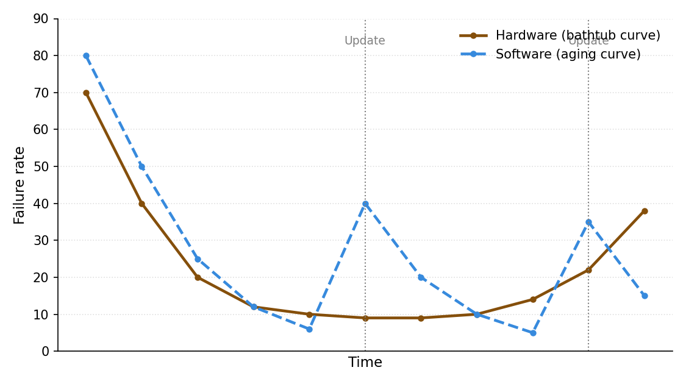
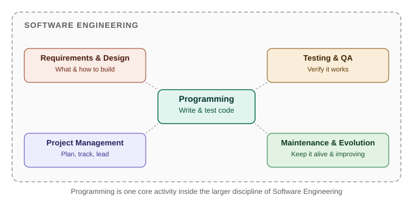
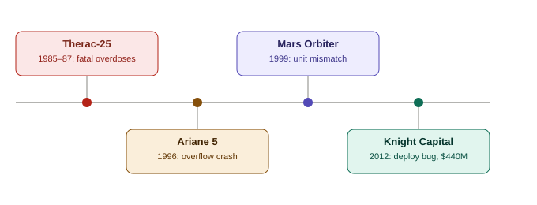

# Day 4 — Tutorial: Software vs Hardware, SE vs Programming, Case Studies
**Course:** CACS253 – Software Engineering | **Unit 1: Introduction (Tutorial Session)**

---

## 1. Discussion: Software vs Hardware

This tutorial builds on the characteristics covered in Day 2, focusing on *why* the difference matters in practice — particularly around failure and maintenance.

| Aspect | Hardware | Software |
|---|---|---|
| **Production** | Manufactured on an assembly line | Engineered/developed individually |
| **Wear** | Physically wears out over time | Doesn't wear out, but logically "ages" through change |
| **Failure pattern** | Bathtub curve — high early, low middle, high late (wear-out) | High early, drops as bugs are fixed, **spikes again after each update** |
| **Fixing a failure** | Replace the worn/broken part | Modify logic carefully — risks introducing new bugs |
| **Quality control focus** | Manufacturing precision, spare parts | Testing, version control, change management |

*(Illustrative shapes — the key idea is that software failure risk rises after every change, not from physical wear.)*

### Discussion Prompt
> Why can't software simply be "replaced" the way a worn hardware part can be? What does this imply about how software teams should plan for the long term?

---

## 2. Discussion: Why Software Engineering Differs from Programming

| Programming | Software Engineering |
|---|---|
| Writing code that works *for you*, right now | Producing software that's reliable, maintainable, and usable *for others*, over years |
| Often a single person | Usually a team, requiring coordination |
| Success = "it runs" | Success = meets requirements + quality attributes (MDEU) + delivered on time/budget |
| Minimal documentation needed | Documentation required for handoff, maintenance, audits |
| No formal process required | Requires requirements analysis, design, testing, project management, configuration management |

### Brooks's Law (key discussion point)
> *"Adding manpower to a late software project makes it later."* — Fred Brooks

This captures a core reason SE is harder than solo programming: as team size grows, communication overhead between people grows even faster, which is why software engineering treats **team coordination and process** as first-class concerns — not just writing correct code.

### Discussion Prompt
> A friend says, "I can already code, so I don't need to study software engineering separately." How would you respond, using today's distinction?

---

## 3. Real-World Case Studies

| Case Study | Year | What Happened | Key SE Lesson |
|---|---|---|---|
| **Therac-25** | 1985–87 | A radiation therapy machine's software bugs caused several fatal radiation overdoses to patients. | Safety-critical software demands far more rigorous testing than ordinary programs. |
| **Ariane 5 Flight 501** | 1996 | Code reused from the earlier Ariane 4 rocket without re-validation triggered a fatal overflow error shortly after launch, destroying the rocket. | Reused components must be re-validated for new operating conditions — "it worked before" isn't proof it's correct now. |
| **Mars Climate Orbiter** | 1999 | One team's navigation software used metric units while another used imperial units; the mismatch caused the spacecraft to be lost. | Clear, agreed interface specifications between teams/modules are essential. |
| **Knight Capital** | 2012 | Leftover test code accidentally went live during a deployment, triggering erratic automated trades that lost the firm roughly $440 million in about 45 minutes. | Disciplined deployment and configuration management practices are critical, even for software that "already works." |

### Discussion Prompt
> Pick one case study. Which Day 1–3 concept (software characteristics, MDEU attributes, or SE challenges) does it best illustrate, and why?

---

## 📝 Tutorial / Viva Questions
- Explain, using an example, why software's failure pattern differs from hardware's.
- What distinguishes "programming" from "software engineering" in terms of scope and team size?
- Explain Brooks's Law and why it matters for managing software projects.
- Choose any one real-world case study and explain which software engineering principle it violated.

---

## 🧠 Memory Tip
**Case studies → "T-A-M-K"**: **T**herac-25 (safety), **A**riane 5 (reuse), **M**ars Orbiter (interfaces), **K**night Capital (deployment).

---

*Reference: Sommerville, I. — Software Engineering (10th Ed.), Pearson — Chapter 1; class discussion notes*