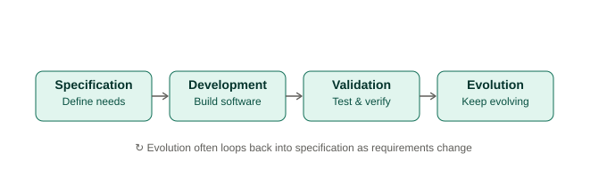
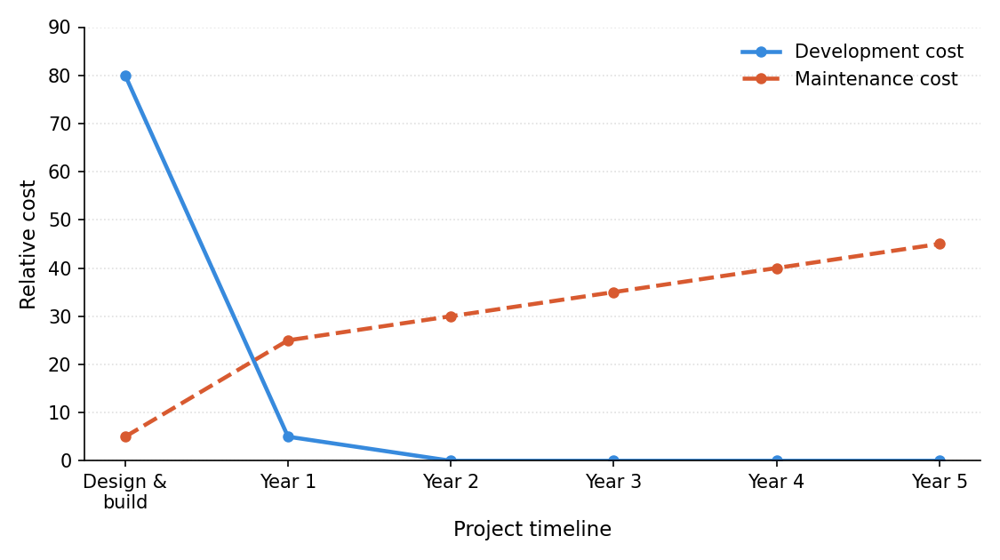
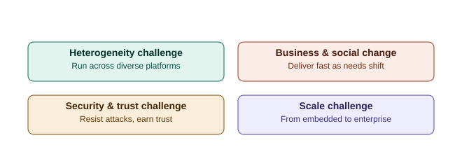

# Day 3 — Definition of Software Engineering, SE Costs & Key Challenges
**Course:** CACS253 – Software Engineering | **Unit 1: Introduction**

---

## 1. Definition of Software Engineering

> **"Software engineering is an engineering discipline that is concerned with all aspects of software production from the early stages of system specification through to maintaining the system after it has gone into use."** — Ian Sommerville

### Breaking the definition down

| Phrase | Meaning |
|---|---|
| **Engineering discipline** | Engineers apply appropriate theories, methods, and tools — using judgment, not rigid rule-following — especially when working under limited resources, time, or budget constraints. |
| **All aspects of software production** | Not just coding — includes project management, requirements work, design, testing, tool selection, and maintenance. The *technical process* and the *management process* both matter. |
| **From specification to maintenance** | SE covers the **entire lifecycle**, not just the build phase — including the (often longer and costlier) period after deployment. |

### Why Software Engineering exists as a discipline
- Software systems are often **large, complex, and intangible** — informal/ad-hoc programming approaches don't scale.
- Failures in software can be costly, dangerous, or even life-threatening (e.g., medical, aviation, financial systems).
- A **systematic, organized, and disciplined approach** is needed to manage cost, quality, and risk.

### The Generic Process Activities

---

## 2. Software Engineering Costs

### General Cost Trends
- **Hardware costs** are decreasing (economies of scale, Moore's Law-driven improvements).
- **Software costs** are increasing — systems are larger, more complex, and more critical than before.
- Distribution of costs across activities (specification, design, coding, testing, maintenance) **varies by project type and process model used** — there's no single fixed ratio.

### Development vs Maintenance Costs
| Cost Phase | Typical Pattern |
|---|---|
| **Development** (specification, design, coding, testing) | Dominates cost *early* in a project's life. |
| **Maintenance** (fixing, adapting, enhancing post-deployment) | Often **exceeds development costs** over a system's *total lifetime*, especially for long-lived systems. |

> 📌 **Key takeaway:** For systems used over many years, the bulk of total cost is usually spent *after* the system is delivered, not before.

*(Illustrative trend — actual proportions vary by project type and process model.)*

### Why Cost Estimation Is Hard
- Software is intangible — progress is difficult to measure precisely.
- Requirements often change mid-project.
- No two software projects are exactly alike (unlike manufacturing).
- *(Detailed estimation models like COCOMO are covered later in Unit 8 — Managing Software Projects.)*

---

## 3. Key Challenges Facing Software Engineering

| Challenge | Description |
|---|---|
| **Heterogeneity Challenge** | Systems must run as distributed systems across diverse platforms, devices, and networks, and must integrate with pre-existing software. |
| **Business & Social Change Challenge** | Business needs and society evolve rapidly — software must be developed and delivered fast enough to keep up. |
| **Security & Trust Challenge** | Since software underpins nearly every part of modern life, it must be secure, reliable, and resistant to malicious attack. |
| **Scale Challenge** | Software must be engineered effectively across a huge range — from small embedded systems to massive enterprise-scale systems. |

---

## 📝 Possible Exam Questions
- State and explain Sommerville's definition of Software Engineering.
- Why does "engineering discipline" matter in the definition of software engineering?
- Explain how software engineering costs are distributed across the development lifecycle. Why do maintenance costs often exceed development costs?
- List and briefly explain the key challenges facing software engineering today.

---

## 🧠 Memory Tip
**Challenges → "H-B-S-S"**: **H**eterogeneity, **B**usiness & social change, **S**ecurity & trust, **S**cale.

---

*Reference: Sommerville, I. — Software Engineering (10th Ed.), Pearson — Chapter 1*