# 🔐 OAuth 2.0 — Complete Study Guide with Spring Boot Implementation

> *Based on video deep dive — covers core concepts, full authorization flow, and hands-on Spring Security 6 implementation.*
> *Designed to be re-read weeks later and still make instant sense.*

---

## 📑 Table of Contents

1. [What is OAuth 2.0?](#1--what-is-oauth-20)
2. [Why OAuth 2.0 Exists](#2--why-oauth-20-exists)
3. [Key Players (Roles)](#3--key-players-roles)
4. [The Complete OAuth 2.0 Flow](#4--the-complete-oauth-20-flow)
5. [Step-by-Step Flow Deep Dive](#5--step-by-step-flow-deep-dive)
6. [Authorization Code Parameters Explained](#6--authorization-code-parameters-explained)
7. [Token Exchange — Server to Server](#7--token-exchange--server-to-server)
8. [Spring Boot Implementation](#8--spring-boot-implementation)
9. [Google Cloud Console Setup](#9--google-cloud-console-setup)
10. [Spring Security Configuration](#10--spring-security-configuration)
11. [Fetching User Data](#11--fetching-user-data)
12. [Security Concepts Explained](#12--security-concepts-explained)
13. [OAuth 2.0 vs Basic Auth](#13--oauth-20-vs-basic-auth)
14. [Interview Questions](#14--interview-questions)
15. [Common Mistakes](#15--common-mistakes)
16. [⚡ Golden Rules](#-golden-rules)
17. [Key Takeaways](#-key-takeaways)

---

## 1 — What is OAuth 2.0?

`📍 Timestamp: 0:31 – 1:54`

**OAuth 2.0** (Open Authorization 2.0) is an **authorization framework** — not an authentication protocol — that allows a third-party application to access a user's resources **without the user sharing their password** with that third-party.

> 🧠 **Real-world analogy — LeetCode + Google:**
> When you click **"Sign in with Google"** on LeetCode:
> - You never give your Google password to LeetCode
> - Google asks *you* directly: "Do you allow LeetCode to see your name and email?"
> - You say yes → Google hands LeetCode a **limited-time token**
> - LeetCode uses that token to get your profile — nothing more
>
> LeetCode never saw your password. Google never gave LeetCode permanent access. You stayed in control.

---

## 2 — Why OAuth 2.0 Exists

### The Problem Before OAuth

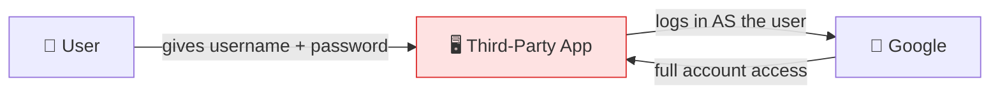

**Before OAuth**, if an app wanted to read your Google contacts, you had to give that app your **actual Google username and password**. That app now had:
- Full access to your entire Google account
- Ability to change your password
- Access you could never easily revoke

### The Solution OAuth Provides

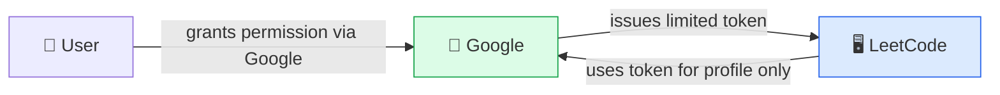

| Without OAuth | With OAuth 2.0 |
|---|---|
| App gets your full password | App gets a limited-scope token |
| Full account access forever | Scoped access (email only, etc.) |
| No way to revoke without changing password | Revoke token anytime from Google settings |
| Third-party stores your credentials | Third-party never sees your password |
| Single point of failure | Isolated, controlled access |

---

## 3 — Key Players (Roles)

`📍 Timestamp: 1:06 – 1:21`

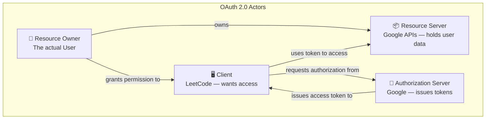

| Role | Who it is | Responsibility |
|---|---|---|
| **Resource Owner** | You (the user) | Owns the data, grants/denies permission |
| **Client** | LeetCode (the app) | Wants access to your data, initiates the flow |
| **Authorization Server** | Google (accounts.google.com) | Authenticates user, issues tokens |
| **Resource Server** | Google APIs (people.googleapis.com) | Holds the actual data, validates tokens |

> 📝 **Note:** Authorization Server and Resource Server are often the same company (both Google), but they are **conceptually separate** and in microservices may literally be separate services.

---

## 4 — The Complete OAuth 2.0 Flow

`📍 Timestamp: 2:51 – 15:13`

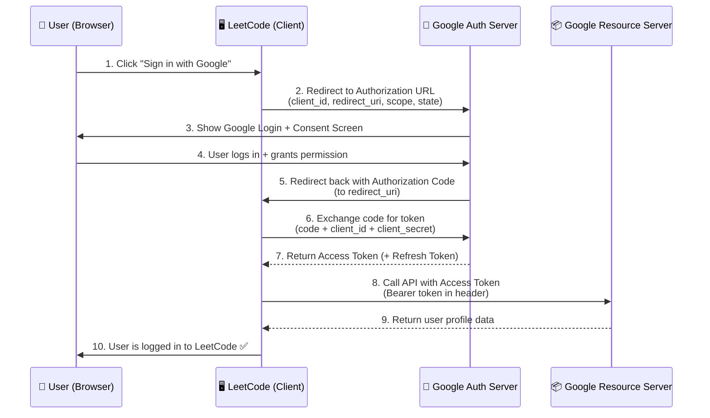

---

## 5 — Step-by-Step Flow Deep Dive

### Step 1 — User Clicks "Sign in with Google"

`📍 Timestamp: 2:51 – 3:30`

The user clicks the button on LeetCode. LeetCode's frontend **redirects the browser** to Google's Authorization URL.

```
Nothing happens on LeetCode's backend yet.
The browser just navigates away to Google.
```

---

### Step 2 — Authorization URL (Client → Google)

`📍 Timestamp: 3:30 – 6:31`

LeetCode constructs and redirects to this URL:

```
https://accounts.google.com/o/oauth2/v2/auth
  ?client_id=abc123.apps.googleusercontent.com
  &redirect_uri=https://leetcode.com/callback
  &response_type=code
  &scope=openid email profile
  &state=xyzRandomSecureString
  &access_type=offline
```

> See [Section 6](#6--authorization-code-parameters-explained) for what each parameter means.

---

### Step 3 — Consent Screen

`📍 Timestamp: 6:47 – 7:21`

Google shows the user:
- A **login form** (if not already signed in)
- A **consent screen** listing exactly what LeetCode is asking for

```
LeetCode wants to:
✅ View your email address
✅ View your basic profile info

[Allow]  [Deny]
```

> ⚠️ The user must **explicitly click Allow**. OAuth does not work without informed consent. This is a legal and ethical requirement.

---

### Step 4 — Authorization Code Returned

`📍 Timestamp: 9:34 – 11:47`

If the user clicks Allow, Google **redirects the browser back** to LeetCode's `redirect_uri` with a short-lived **Authorization Code** in the URL:

```
https://leetcode.com/callback
  ?code=4/0AeaYSH...AbcXyz
  &state=xyzRandomSecureString
```

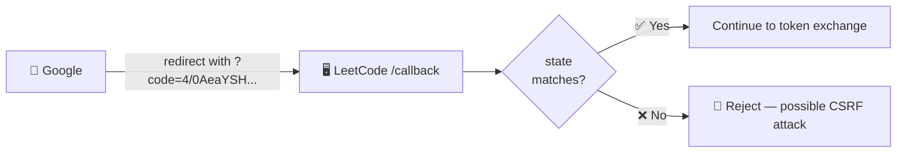

> 🧠 **Key fact:** The Authorization Code is:
> - Short-lived (typically 5–10 minutes)
> - Single-use only
> - Useless without the `client_secret`
> - Visible in the browser URL — which is why it's just a *code*, not the actual token

---

### Step 5 — Token Exchange (Backend to Backend)

`📍 Timestamp: 13:03 – 14:38`

LeetCode's **backend server** makes a direct server-to-server `POST` request to Google — this never touches the browser:

```http
POST https://oauth2.googleapis.com/token
Content-Type: application/x-www-form-urlencoded

code=4/0AeaYSH...AbcXyz
&client_id=abc123.apps.googleusercontent.com
&client_secret=GOCSPX-secret_never_exposed
&redirect_uri=https://leetcode.com/callback
&grant_type=authorization_code
```

Google responds with:

```json
{
  "access_token": "ya29.A0AfH...",
  "expires_in": 3599,
  "token_type": "Bearer",
  "scope": "openid email profile",
  "refresh_token": "1//0g...",
  "id_token": "eyJhbGci..."
}
```

> 🔐 **Why server-to-server?** The `client_secret` must **never** appear in the browser or mobile app. If it did, any user could find it in browser DevTools and impersonate the app. Server-to-server calls are not visible to the user.

---

### Step 6 — Fetch User Profile

`📍 Timestamp: 14:40 – 15:13`

LeetCode uses the Access Token to call Google's People API:

```http
GET https://www.googleapis.com/oauth2/v2/userinfo
Authorization: Bearer ya29.A0AfH...
```

Google returns:

```json
{
  "id": "1234567890",
  "email": "sharwan@gmail.com",
  "name": "Sharwan Kunwar",
  "picture": "https://lh3.googleusercontent.com/..."
}
```

LeetCode now creates (or finds) a user account and logs the person in — **without ever knowing their Google password**.

---

## 6 — Authorization Code Parameters Explained

`📍 Timestamp: 3:30 – 6:31`

| Parameter | Example Value | Purpose |
|---|---|---|
| `client_id` | `abc123.apps.googleusercontent.com` | Identifies which app is requesting access (public, safe to expose) |
| `redirect_uri` | `https://leetcode.com/callback` | Where Google sends the user back after consent. Must exactly match what was registered in Google Cloud Console |
| `response_type` | `code` | Tells Google we want an Authorization Code (not a token directly) |
| `scope` | `openid email profile` | What permissions the app is requesting. User sees exactly these on the consent screen |
| `state` | `xyzRandomSecureString` | A random value the client generates and verifies on callback — **protects against CSRF attacks** |
| `access_type` | `offline` | If `offline`, Google also returns a Refresh Token for long-lived access |
| `grant_type` | `authorization_code` | (Used in token exchange) Declares which OAuth grant type flow is being used |

> ⚡ **`state` parameter is not optional for production.** If you skip it, your authorization endpoint is vulnerable to CSRF. When Google calls back, verify that the `state` value matches what you sent.

---

## 7 — Token Exchange — Server to Server

`📍 Timestamp: 13:03 – 14:38`

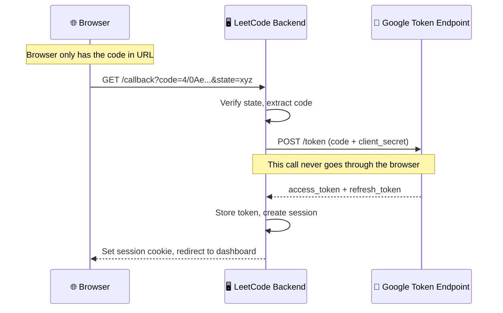

### Token Types Comparison

| Token | Lifespan | Purpose | Stored where |
|---|---|---|---|
| **Authorization Code** | 5–10 minutes, single use | Exchange for tokens | Browser URL (temporary) |
| **Access Token** | 1 hour typically | Call protected APIs | Backend server memory / DB |
| **Refresh Token** | Days / months | Get new access token without user login | Backend server (securely) |
| **ID Token** (OpenID) | 1 hour | Contains user identity info (JWT) | Backend server |

---

## 8 — Spring Boot Implementation

`📍 Timestamp: 17:52 – 20:38`

### Step 1 — Add Dependency

```xml
<!-- pom.xml -->
<dependency>
    <groupId>org.springframework.boot</groupId>
    <artifactId>spring-boot-starter-oauth2-client</artifactId>
</dependency>

<dependency>
    <groupId>org.springframework.boot</groupId>
    <artifactId>spring-boot-starter-security</artifactId>
</dependency>

<dependency>
    <groupId>org.springframework.boot</groupId>
    <artifactId>spring-boot-starter-web</artifactId>
</dependency>
```

---

### Step 2 — Configure application.yml

```yaml
# application.yml
spring:
  security:
    oauth2:
      client:
        registration:
          google:                          # ← "google" is the provider key Spring knows by default
            client-id: YOUR_CLIENT_ID
            client-secret: YOUR_CLIENT_SECRET
            scope:
              - openid
              - email
              - profile
            redirect-uri: "{baseUrl}/login/oauth2/code/{registrationId}"
            # Spring auto-builds: http://localhost:8080/login/oauth2/code/google
```

> 📝 **Note:** The `redirect-uri` template `{baseUrl}/login/oauth2/code/{registrationId}` is a **Spring Security convention** — it auto-registers `/login/oauth2/code/google` as the callback URL. You must register exactly this URL in Google Cloud Console.

> ⚠️ **Never commit `client-secret` to GitHub.** Use environment variables:
> ```yaml
> client-secret: ${GOOGLE_CLIENT_SECRET}
> ```

---

## 9 — Google Cloud Console Setup

`📍 Timestamp: 20:54 – 26:03`

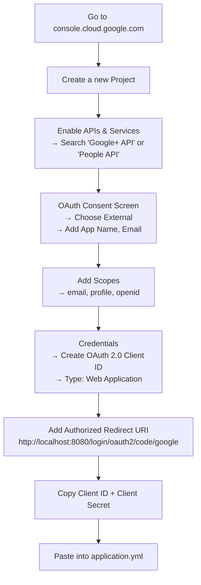

### Step-by-Step Console Checklist

| Step | Where | What to do |
|---|---|---|
| 1 | [console.cloud.google.com](https://console.cloud.google.com) | Create a new project |
| 2 | APIs & Services → Library | Enable "Google People API" |
| 3 | APIs & Services → OAuth Consent Screen | Choose **External**, fill app name + email |
| 4 | Consent Screen → Scopes | Add: `email`, `profile`, `openid` |
| 5 | Credentials → Create Credentials | Choose **OAuth 2.0 Client ID** |
| 6 | Application type | Select **Web Application** |
| 7 | Authorized redirect URIs | Add: `http://localhost:8080/login/oauth2/code/google` |
| 8 | After creation | Copy **Client ID** and **Client Secret** |
| 9 | `application.yml` | Paste both values (or set as env vars) |

> ⚠️ The redirect URI in Google Console must **exactly match** what Spring Boot generates. One trailing slash difference will cause an error.

---

## 10 — Spring Security Configuration

`📍 Timestamp: 27:14 – 29:22`

```java
// SecurityConfig.java
@Configuration
@EnableWebSecurity
public class SecurityConfig {

    @Bean
    public SecurityFilterChain securityFilterChain(HttpSecurity http) throws Exception {
        http
            .authorizeHttpRequests(auth -> auth
                .requestMatchers("/", "/public/**").permitAll()  // public routes
                .anyRequest().authenticated()                    // everything else needs login
            )
            .oauth2Login(oauth2 -> oauth2
                .loginPage("/login")                            // optional: custom login page
                .defaultSuccessUrl("/dashboard", true)         // where to go after success
                .failureUrl("/login?error=true")               // where to go on failure
            )
            .logout(logout -> logout
                .logoutSuccessUrl("/")
                .clearAuthentication(true)
                .invalidateHttpSession(true)
            );

        return http.build();
    }
}
```

### What `.oauth2Login()` Does Automatically

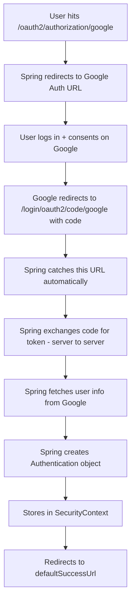

> 🧠 **Spring Security 6 does all of Steps E → J automatically** when you add `.oauth2Login()`. You do not write the token exchange or user info fetch yourself — Spring handles the entire OAuth flow internally.

| What Spring handles automatically | What you configure |
|---|---|
| Redirect to Google | ✅ Auto | App credentials in `application.yml` |
| Callback route `/login/oauth2/code/google` | ✅ Auto | Redirect URI in Google Console |
| Token exchange (server-to-server) | ✅ Auto | Nothing |
| User info fetch | ✅ Auto | Scopes in `application.yml` |
| SecurityContext population | ✅ Auto | Nothing |
| Session creation | ✅ Auto | Session config (optional) |

---

## 11 — Fetching User Data

`📍 Timestamp: 32:32 – 36:08`

After successful login, Spring stores the user's information in the `SecurityContext`. You can access it in three ways:

### Method 1 — `@AuthenticationPrincipal` (Recommended)

```java
@RestController
public class UserController {

    @GetMapping("/profile")
    public Map<String, Object> getProfile(
            @AuthenticationPrincipal OAuth2User principal) {

        String name  = principal.getAttribute("name");
        String email = principal.getAttribute("email");
        String pic   = principal.getAttribute("picture");

        return Map.of(
            "name",    name,
            "email",   email,
            "picture", pic
        );
    }
}
```

### Method 2 — `SecurityContextHolder` (Anywhere in the app)

```java
@Service
public class AuthService {

    public String getCurrentUserEmail() {
        Authentication auth = SecurityContextHolder
                .getContext()
                .getAuthentication();

        OAuth2User user = (OAuth2User) auth.getPrincipal();
        return user.getAttribute("email");
    }
}
```

### Method 3 — `OidcUser` (When using OpenID Connect / `openid` scope)

```java
@GetMapping("/profile")
public Map<String, Object> getProfile(
        @AuthenticationPrincipal OidcUser oidcUser) {

    // OidcUser has typed getters — cleaner than getAttribute()
    return Map.of(
        "name",    oidcUser.getFullName(),
        "email",   oidcUser.getEmail(),
        "picture", oidcUser.getPicture(),
        "subject", oidcUser.getSubject()   // Google's unique user ID
    );
}
```

### Available Attributes from Google

```json
{
  "sub":            "1234567890",
  "name":           "Sharwan Kunwar",
  "given_name":     "Sharwan",
  "family_name":    "Kunwar",
  "picture":        "https://lh3.googleusercontent.com/...",
  "email":          "sharwan@gmail.com",
  "email_verified": true,
  "locale":         "en"
}
```

| Attribute | Getter on `OidcUser` | `getAttribute()` key |
|---|---|---|
| Unique ID | `getSubject()` | `"sub"` |
| Full name | `getFullName()` | `"name"` |
| First name | `getGivenName()` | `"given_name"` |
| Last name | `getFamilyName()` | `"family_name"` |
| Email | `getEmail()` | `"email"` |
| Profile picture URL | `getPicture()` | `"picture"` |

---

## 12 — Security Concepts Explained

### Authorization Code vs Implicit Flow

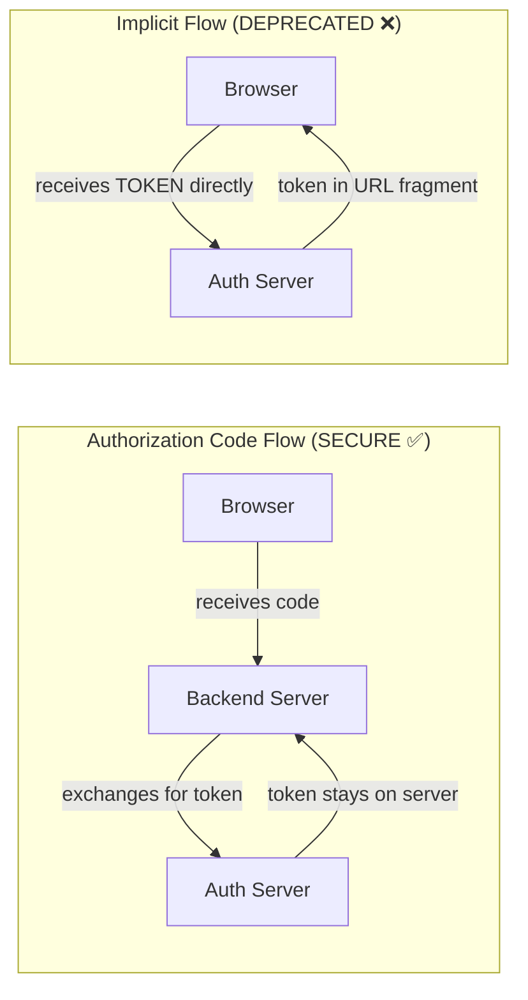

| Flow | Token exposed to browser? | `client_secret` needed? | Status |
|---|---|---|---|
| Authorization Code | ❌ No | ✅ Yes (server-side) | ✅ Recommended |
| Implicit | ✅ Yes (in URL) | ❌ No | ❌ Deprecated (RFC 9700) |
| Client Credentials | N/A (machine to machine) | ✅ Yes | ✅ For backend services |
| Device Code | N/A (TV/CLI) | ✅ Yes | ✅ For limited-input devices |

### What is `scope`?

Scope defines the **exact permissions** the client is requesting. The user sees exactly these on the consent screen.

| Scope | What Google returns |
|---|---|
| `email` | Email address, `email_verified` |
| `profile` | Name, picture, locale |
| `openid` | ID Token (JWT) — enables OpenID Connect |
| `https://www.googleapis.com/auth/calendar` | Full calendar access |
| `https://www.googleapis.com/auth/gmail.readonly` | Read-only Gmail access |

> 🧠 **Always request minimum scope.** Only ask for what you actually need. A consent screen asking for Gmail + Calendar when you only need email will drive users away.

### What is PKCE?

**PKCE** (Proof Key for Code Exchange, pronounced "pixie") is an extension that protects the Authorization Code flow in **public clients** (mobile apps, SPAs) where a `client_secret` cannot be kept safe.

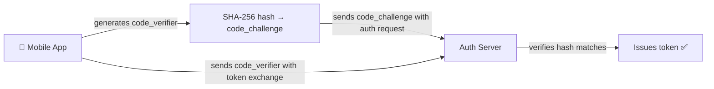

> Spring Security 6 enables PKCE automatically for public clients.

---

## 13 — OAuth 2.0 vs Basic Auth

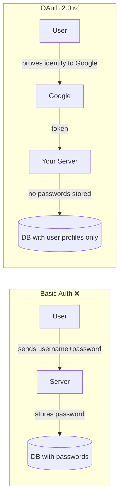

| Aspect | Basic Auth | OAuth 2.0 |
|---|---|---|
| Password stored by your app | ✅ Yes (hash at minimum) | ❌ No — Google holds it |
| User must create another account | ✅ Yes | ❌ No — reuses existing |
| Password breach risk for your app | High | Near zero |
| Access can be revoked per-app | ❌ No | ✅ Yes (from Google settings) |
| Granular permission scopes | ❌ No | ✅ Yes |
| Implementation complexity | Low | Medium |
| Best for | Internal tools, simple apps | User-facing apps, third-party access |

---

## 14 — Interview Questions

**Q1: What is OAuth 2.0 and what problem does it solve?**
> OAuth 2.0 is an authorization framework that lets third-party apps access user resources without requiring the user to share their password with that third party. It solves the credential-sharing problem by introducing delegated, scoped, revocable access via tokens.

**Q2: What is the difference between Authentication and Authorization?**
> Authentication = verifying *who you are* (proving your identity). Authorization = verifying *what you're allowed to do* (checking permissions). OAuth 2.0 is strictly an authorization protocol. OpenID Connect (OIDC) is the authentication layer built on top of it.

**Q3: What are the four roles in OAuth 2.0?**
> Resource Owner (user), Client (the app requesting access), Authorization Server (issues tokens — e.g., Google), Resource Server (hosts protected data — e.g., Google APIs).

**Q4: What is an Authorization Code and why is it used instead of returning the token directly?**
> The Authorization Code is a short-lived, single-use code returned to the browser via redirect. It is then exchanged server-side (with the client_secret) for the actual token. This two-step process keeps the token off the browser URL and requires the client_secret for the final exchange, making interception of the code alone useless.

**Q5: Why must the token exchange happen server-to-server?**
> Because the `client_secret` must be included in the token exchange request. The client_secret must never be exposed to the browser (visible in DevTools). Server-to-server calls are invisible to the user and not accessible from the browser.

**Q6: What is the `state` parameter and why is it important?**
> The `state` is a random value the client generates before redirecting to the Authorization URL. When Google calls back, the client verifies the returned `state` matches what was sent. This prevents CSRF attacks where a malicious site tricks a user into authorizing under a different account.

**Q7: What is `scope` in OAuth 2.0?**
> Scope defines the specific permissions the client is requesting. The user sees these on the consent screen. Best practice is to request minimum necessary scope only.

**Q8: What is the difference between an Access Token and a Refresh Token?**
> Access Token: short-lived (typically 1 hour), used to call protected APIs. Refresh Token: long-lived, used to get a new Access Token when the old one expires, without requiring the user to log in again.

**Q9: What does `@AuthenticationPrincipal` do in Spring Boot?**
> It injects the currently authenticated user's principal object directly into a controller method parameter. For OAuth2 logins, this is an `OAuth2User` or `OidcUser` containing the user's profile attributes from the provider.

**Q10: What does `.oauth2Login()` configure in Spring Security 6?**
> It registers Spring's built-in OAuth2 login filter chain that handles: redirecting to the provider, catching the callback URL, exchanging the code for a token (server-side), fetching user info, populating the SecurityContext, and managing the session. All of these happen automatically without manual implementation.

**Q11: What is OpenID Connect (OIDC) and how does it relate to OAuth?**
> OIDC is an authentication layer on top of OAuth 2.0. OAuth handles authorization (can this app access my data?). OIDC handles authentication (who is this user?) by adding an ID Token (a JWT) to the OAuth flow that carries identity claims about the user.

**Q12: What is PKCE and when is it needed?**
> Proof Key for Code Exchange protects the Authorization Code flow for public clients (mobile apps, SPAs) that cannot safely store a client_secret. The app generates a code_verifier, hashes it to a code_challenge, sends the challenge with the auth request, and then proves knowledge of the original verifier during token exchange.

---

## 15 — Common Mistakes

| Mistake | Why it's wrong | Fix |
|---|---|---|
| Committing `client-secret` to Git | Exposed to anyone with repo access | Use env vars: `${GOOGLE_CLIENT_SECRET}` |
| Mismatched `redirect_uri` | Google rejects with `redirect_uri_mismatch` error | Copy the exact URL Spring generates into Google Console |
| Skipping `state` parameter validation | CSRF vulnerability | Always verify `state` on callback |
| Requesting too many scopes | Users reject consent or app gets flagged | Request minimum necessary scopes only |
| Using Implicit Flow for new projects | Token exposed in browser URL, deprecated | Always use Authorization Code flow |
| Storing Access Token in localStorage | XSS attack can steal it | Store tokens server-side in session |
| Not handling token expiry | API calls start failing after 1 hour | Implement refresh token rotation |
| Using `OAuth2User` when `openid` scope added | Miss typed getters on `OidcUser` | Use `OidcUser` when `openid` scope is present |

---

## ⚡ Golden Rules

```
⚡ Rule 1 — client_secret must NEVER touch the browser
            Token exchange always happens server-to-server

⚡ Rule 2 — Always validate the state parameter on callback
            Prevents CSRF attacks on your login flow

⚡ Rule 3 — Request minimum scope
            Only ask for what your app actually uses

⚡ Rule 4 — Authorization Code ≠ Access Token
            The code is just a voucher. Only exchangeable with client_secret.

⚡ Rule 5 — Use OidcUser (not OAuth2User) when openid scope is present
            OidcUser gives you typed getters; OAuth2User only has getAttribute()

⚡ Rule 6 — redirect_uri must be registered exactly in the provider console
            One character difference = mismatch error

⚡ Rule 7 — OAuth 2.0 is Authorization, NOT Authentication
            OpenID Connect (OIDC) adds authentication on top of OAuth
```

---

## 🔄 Complete Flow — One Final Diagram

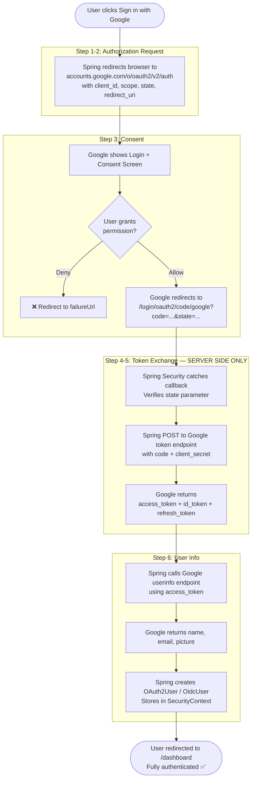

---

## 🎯 Key Takeaways

- **OAuth 2.0 is authorization**, not authentication. OpenID Connect is the authentication layer built on top.
- The **Authorization Code flow** is the correct flow for web apps — never use Implicit Flow.
- The **client_secret never touches the browser** — token exchange is always server-to-server.
- The **`state` parameter** is mandatory in production — it prevents CSRF attacks.
- **Spring Security 6** handles the entire OAuth flow automatically with `.oauth2Login()` — you only configure credentials and routes.
- Access user data with **`@AuthenticationPrincipal OidcUser`** when `openid` scope is included (recommended).
- **Never commit credentials** — use environment variables or a secrets manager.
- **Minimum scope** — only request what the app actually needs.

---

