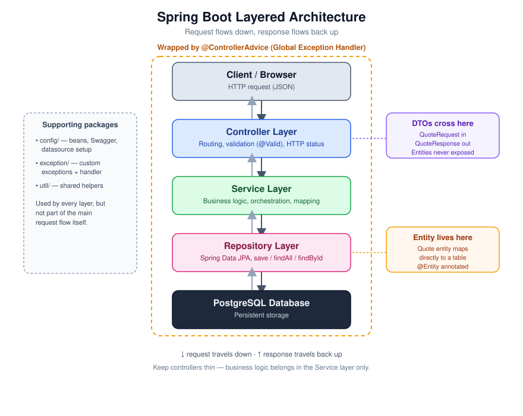
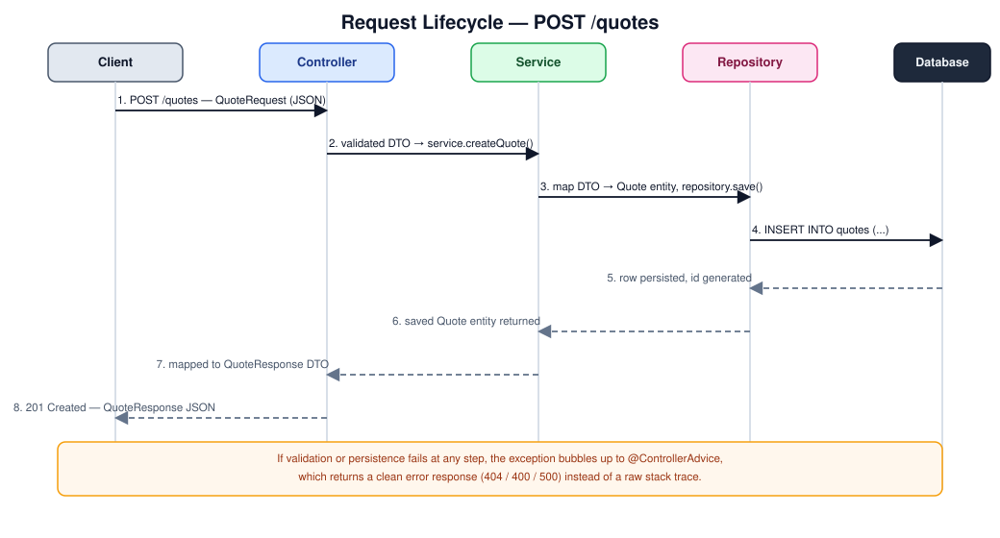
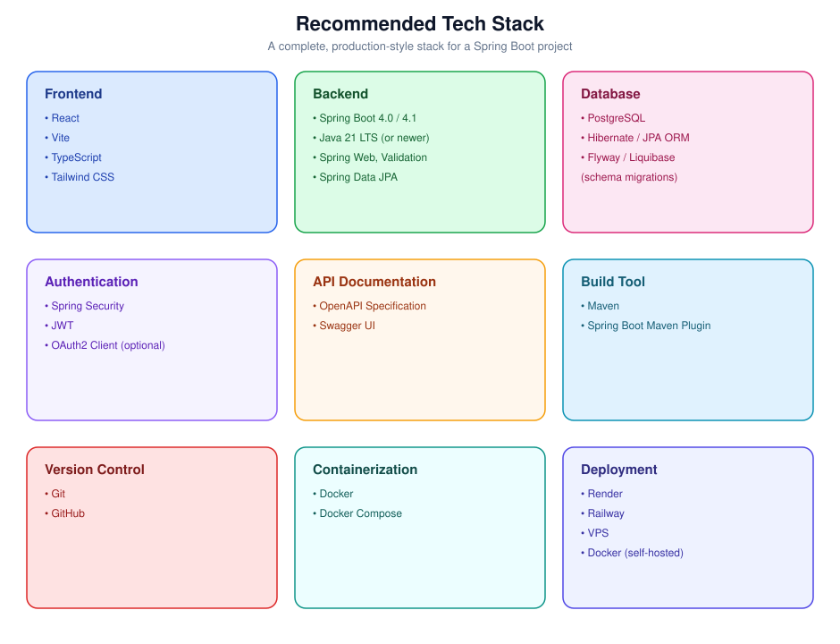

# 🚀 Spring Boot Project Best Practices

A step-by-step guide to configuring, structuring, and building scalable, maintainable Spring Boot applications — from Spring Initializr setup through layered architecture, naming conventions, and deployment.

> 📌 **2026 update:** Spring Boot 3.5 reaches end of OSS support on **June 30, 2026**. New projects should target **Spring Boot 4.0.x or 4.1.x** (built on Spring Framework 7, minimum Java 17). If your team has a hard dependency that forces you to stay on the 3.x line, 3.5 is the last and most current release in that branch — but treat it as a migration deadline, not a long-term home.

## Table of Contents

1. [Initialize the Project](#step-1--initialize-the-project)
2. [Naming Conventions](#step-2--naming-conventions)
3. [Choose Your Dependencies](#step-3--choose-your-dependencies)
4. [Lay Out the Project Structure](#step-4--lay-out-the-project-structure)
5. [Understand the Layered Architecture](#step-5--understand-the-layered-architecture)
6. [Trace a Request Through the Layers](#step-6--trace-a-request-through-the-layers)
7. [Layer-by-Layer Responsibilities](#step-7--layer-by-layer-responsibilities)
8. [Configure application.properties](#step-8--configure-applicationproperties)
9. [Naming Conventions Cheat Sheet](#step-9--naming-conventions-cheat-sheet)
10. [Best Practices Checklist](#step-10--best-practices-checklist)
11. [Recommended Tech Stack](#step-11--recommended-tech-stack)
12. [Common Pitfalls](#step-12--common-pitfalls)
13. [Goal](#-goal)

---

## Step 1 — Initialize the Project

Start from [Spring Initializr](https://start.spring.io) with the following configuration:

| Option | Recommended Value |
|---|---|
| **Project** | Maven |
| **Language** | Java |
| **Spring Boot** | 4.0.x or 4.1.x (latest stable) |
| **Group** | `com.sharwan` or `com.unpredictable` |
| **Artifact** | `quote-service` |
| **Name** | `quote-service` |
| **Package Name** | `com.sharwan.quoteservice` |
| **Packaging** | Jar |
| **Java Version** | 21 LTS (recommended) — 17 is the minimum supported |

Once downloaded, you can verify and build the project immediately:

```bash
cd quote-service
./mvnw clean install
./mvnw spring-boot:run
```

---

## Step 2 — Naming Conventions

### Group Naming

❌ Avoid generic placeholder groups:

```text
com.example
```

✅ Prefer a personal or organization-specific namespace:

```text
com.sharwan
```

or

```text
com.unpredictable
```

Putting it together:

```text
Group:    com.sharwan
Artifact: quote-service
Package:  com.sharwan.quoteservice
```

A distinct group ID matters once you publish artifacts to a shared Maven repository, package the app for distribution, or simply want your codebase to be unambiguously yours rather than a copy-pasted tutorial skeleton.

---

## Step 3 — Choose Your Dependencies

### Core REST API

- Spring Web
- Spring Data JPA
- PostgreSQL Driver
- Validation
- Lombok
- Spring Boot DevTools
- Spring Configuration Processor

### Authentication

- Spring Security
- JWT
- OAuth2 Client *(optional, for third-party login)*

### Data & Migrations

- Flyway or Liquibase *(strongly recommended — see note below)*

### Containerization

- Docker Compose Support *(optional, but convenient for local Postgres)*

> 💡 **Why add Flyway/Liquibase?** `spring.jpa.hibernate.ddl-auto=update` (used later in this guide) is fine for local prototyping, but it silently drifts your schema in any environment with more than one developer. A migration tool gives you versioned, reviewable, repeatable schema changes — treat the `update` setting as a development-only convenience, never a production strategy.

---

## Step 4 — Lay Out the Project Structure

```text
quote-service
│
├── src
│   ├── main
│   │   ├── java
│   │   │   └── com
│   │   │       └── sharwan
│   │   │           └── quoteservice
│   │   │               ├── config
│   │   │               │     ├── DatabaseConfig.java
│   │   │               │     └── SwaggerConfig.java
│   │   │               │
│   │   │               ├── controller
│   │   │               │     └── QuoteController.java
│   │   │               │
│   │   │               ├── dto
│   │   │               │     ├── QuoteRequest.java
│   │   │               │     └── QuoteResponse.java
│   │   │               │
│   │   │               ├── entity
│   │   │               │     └── Quote.java
│   │   │               │
│   │   │               ├── repository
│   │   │               │     └── QuoteRepository.java
│   │   │               │
│   │   │               ├── service
│   │   │               │     ├── QuoteService.java
│   │   │               │     └── impl
│   │   │               │           └── QuoteServiceImpl.java
│   │   │               │
│   │   │               ├── exception
│   │   │               │     ├── ResourceNotFoundException.java
│   │   │               │     └── GlobalExceptionHandler.java
│   │   │               │
│   │   │               ├── util
│   │   │               │
│   │   │               └── QuoteServiceApplication.java
│   │   │
│   │   └── resources
│   │       ├── application.properties
│   │       ├── static
│   │       └── templates
│   │
│   └── test
│       └── java/com/sharwan/quoteservice   (mirrors main, see Step 10)
│
├── pom.xml
└── README.md
```

Every package maps to one concern: `controller` only talks HTTP, `service` only thinks in business rules, `repository` only talks to the database. That separation is what makes the architecture in the next step possible.

---

## Step 5 — Understand the Layered Architecture

Before diving into each layer's responsibilities, it helps to see how they connect. A request enters through the Controller, flows down through Service and Repository, and reaches the Database — with DTOs guarding the boundary at the top and Entities living at the boundary near the database.



The dashed boundary represents `@ControllerAdvice` — it wraps the Controller, Service, and Repository layers so that any exception thrown anywhere in that chain gets converted into a clean, consistent HTTP error response instead of leaking a stack trace to the client.

---

## Step 6 — Trace a Request Through the Layers

Seeing the architecture as a static diagram is useful, but seeing an actual request move through it makes the responsibilities click. Here's what happens end-to-end for a single `POST /quotes` call:



Notice the symmetry: the DTO (`QuoteRequest`) goes in, gets transformed into an `Entity` (`Quote`) for persistence, and a *different* DTO (`QuoteResponse`) comes back out. The client never sees the entity directly in either direction.

---

## Step 7 — Layer-by-Layer Responsibilities

### Controller

Handles HTTP requests and nothing else:

```http
GET    /quotes
POST   /quotes
DELETE /quotes/{id}
```

Responsibilities: receive client requests, validate input (`@Valid`), call the Service layer, and return HTTP responses. Keep controllers thin — no business logic here.

### Service

Contains all business logic: validation rules, data processing, calling repositories, and returning DTOs. If a senior engineer reading only the Service layer can't understand *why* the application does what it does, logic has leaked into the wrong layer.

### Repository

Responsible for database communication via Spring Data JPA's generated methods:

```java
save()
findAll()
findById()
delete()
```

### Entity

Represents a database table directly, e.g. `Quote`. Entities should stay inside the Repository/Service boundary and never be serialized straight to JSON.

### DTO (Data Transfer Object)

Never expose entities directly over the API. Use dedicated request/response shapes instead:

```text
QuoteRequest
QuoteResponse
```

Benefits: cleaner APIs, better security (no accidental field leakage), easier long-term maintenance, and the freedom to reshape your database schema without breaking API consumers. For larger projects, a mapping library like **MapStruct** removes the boilerplate of hand-writing entity ↔ DTO conversions.

### Exception Handling

Centralize error handling with `@ControllerAdvice` so every layer reports failures the same way:

```text
404 Not Found
400 Bad Request
500 Internal Server Error
```

---

## Step 8 — Configure application.properties

```properties
spring.application.name=quote-service

spring.datasource.url=jdbc:postgresql://localhost:5432/quotes
spring.datasource.username=postgres
spring.datasource.password=your_password

spring.jpa.hibernate.ddl-auto=update
spring.jpa.show-sql=true
```

> ⚠️ Never commit real credentials here. Use environment variables or a `.env`-style profile (`application-local.properties`, excluded via `.gitignore`) and reference them with `${DB_PASSWORD}` syntax in the committed file.

---

## Step 9 — Naming Conventions Cheat Sheet

| Element | ❌ Avoid | ✅ Prefer |
|---|---|---|
| Project | `QuoteApplication` | `quote-service` |
| Controller | `UserController1` | `UserController` |
| Entity | `QuoteEntity` | `Quote` |
| Repository | `QuoteRepositoryImpl` | `QuoteRepository` *(Spring Data JPA generates the implementation automatically)* |

---

## Step 10 — Best Practices Checklist

- Keep controllers thin; place business logic inside services.
- Use constructor injection instead of field injection, preferring `@RequiredArgsConstructor`.
- Validate requests with `@Valid` and return descriptive 400 responses on failure.
- Use DTOs instead of exposing entities directly.
- Create a global exception handler with `@ControllerAdvice`.
- Keep configuration classes inside the `config` package.
- Store secrets in environment variables, never in committed `.properties` files.
- Write both unit tests (service logic, mocked repositories) and integration tests (real or Testcontainers-backed database).
- Follow consistent package naming conventions across the codebase.
- Use meaningful, intention-revealing class and method names.
- Keep methods small and focused on a single responsibility.
- Version your schema changes with Flyway or Liquibase rather than relying on `ddl-auto=update`.

---

## Step 11 — Recommended Tech Stack



| Category | Tools |
|---|---|
| Frontend | React, Vite, TypeScript, Tailwind CSS |
| Backend | Spring Boot 4.0/4.1, Java 21 LTS |
| Database | PostgreSQL |
| Authentication | Spring Security, JWT |
| API Documentation | OpenAPI / Swagger |
| Build Tool | Maven |
| Version Control | Git, GitHub |
| Containerization | Docker, Docker Compose |
| Deployment | Render, Railway, VPS, Docker |

---

## Step 12 — Common Pitfalls

- **Letting `ddl-auto=update` reach production.** It works fine solo, then silently corrupts schemas the moment a second developer or environment joins the project.
- **Putting `@Transactional` on the Controller instead of the Service.** Transactions belong around business operations, not HTTP handling.
- **Returning entities from a `@RestController` method.** Even if it "just works" today, you've coupled your API contract to your database schema — the first migration that adds a lazy-loaded relationship will break serialization.
- **Field injection (`@Autowired` on fields).** It hides required dependencies, makes classes hard to test, and is easy to forget when refactoring. Constructor injection makes dependencies explicit and testable.
- **One giant `@ControllerAdvice` that returns generic 500s for everything.** Map specific exceptions (`ResourceNotFoundException` → 404, `MethodArgumentNotValidException` → 400) so API consumers get actionable error responses.
- **Skipping integration tests because "the unit tests pass."** Unit tests with mocked repositories can't catch a missing column, a wrong query, or a misconfigured `application.properties` — only an integration test against a real (or Testcontainers) database can.

---

## 🎯 Goal

Following this structure helps you build clean architecture, scalable applications, production-ready APIs, easier long-term maintenance, smoother team collaboration, and a stronger professional portfolio project.
